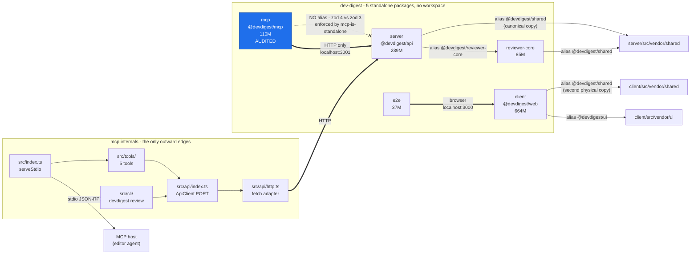

# Dependency audit - 2026-08-27

## Summary

- **Scope: `mcp/` only.** This is a narrow run, not a full-repo audit.
The other four packages appear in the Weight table and the machine summary as
measurements only, with no judgement attached to them.
- **First audit, no baseline.** The audits directory holds no earlier report,
so there is nothing to diff against.
- The single most expensive fact: `mcp/` costs **110 MB on disk to run 14 MB of
code**.
Two runtime dependencies (`@modelcontextprotocol/server`, `zod`) plus the SDK's
own `@modelcontextprotocol/core` are the entire shipping surface;
`typescript` (23 MB) and `js-tiktoken` (21 MB) alone are 40% of the tree and
neither one ever enters the server process.
- **One CI gate does not fire.** `mcp-has-no-db-or-framework` matches paths like
`node_modules/fastify`, but under pnpm's isolated layout an installed package
resolves to `node_modules/.pnpm/fastify@5.x/node_modules/fastify/...`, which the
regex misses.
Verified against the real graph, and verified fixed by one option
(`preserveSymlinks: true`). The same blind spot silences the node_modules half
of `cli-does-not-import-the-mcp-server`.
- **Hygiene is otherwise unusually good here.** The lockfile is committed and in
sync, there are no undeclared script binaries, no unused runtime dependencies,
and every dev dependency I checked is genuinely used.
The zod 4 divergence is deliberate and documented in three places.
- The 2 runtime deps are honest only for the library; the *process* needs 5,
because both `bin/` launchers exec `tsx` and `tsx` is declared dev.

## Map



## Weight

Per-package, as installed on this machine. `ships` is the count of entries under
`dependencies`; everything else is tooling that never reaches a running process.

| Package | Disk | Layout | Declared | Ships | Top-level installed |
|---|---:|---|---:|---:|---:|
| `client` | 664 M | hoisted | 29 | 12 | 513 |
| `server` | 239 M | hoisted | 32 | 24 | 335 |
| **`mcp`** | **110 M** | **isolated** | **9** | **2** | **8** |
| `reviewer-core` | 85 M | hoisted | 7 | 2 | 115 |
| `e2e` | 37 M | hoisted | 3 | 0 | 3 |

Only `mcp` was audited. The four other rows are the collector's measurements,
carried here so the next audit has a baseline to diff.

### What is actually heavy inside `mcp` (110 M, 111 packages in `.pnpm`)

| Package | Size | Runtime? | Why it is here |
|---|---:|---|---|
| `typescript` | 23 M | no | `pnpm typecheck` binary |
| `js-tiktoken` | 21 M | no | `scripts/token-budget.ts`; 21 M of it is `dist/` BPE rank tables |
| `esbuild@0.28.2` + darwin binary | 10 M | **yes** | pulled by `tsx`, which both `bin/` launchers exec |
| `esbuild@0.21.5` + darwin binary | 9 M | no | pulled by `vite@5` under `vitest@2` |
| `@modelcontextprotocol/client` | 7 M | no | test client + budget script |
| `zod` | 6 M | **yes** | the SDK's schema layer, and `src/api/schemas.ts` |
| `@modelcontextprotocol/server` | 6 M | **yes** | `serveStdio`, `McpServer` |
| `vite` | 3 M | no | vitest |
| `rollup` + darwin binary | 5 M | no | vite |
| `@types/node` | 2 M | no | types only |
| `vitest` | 2 M | no | test runner |
| `dependency-cruiser` | 2 M | no | `pnpm arch:check` binary |
| `@modelcontextprotocol/core` | 1 M | **yes** | transitive of both SDK halves |
| `tsx` | 0.7 M | **yes** | the interpreter `bin/devdigest-mcp` execs |

**What actually ships.** Starting `bin/devdigest-mcp` loads
`@modelcontextprotocol/server` + `@modelcontextprotocol/core` + `zod`, about
**14 M across 3 packages**. Add the interpreter the launcher execs (`tsx` plus
its `esbuild@0.28.2`) and the honest runtime figure is **~25 M across 5
packages** - roughly a fifth of the 110 M tree. The remaining 85 M is
typecheck, test and lint tooling that exists only on a developer's disk and on
the CI runner.

## Findings

### boundaries

#### high - `mcp-has-no-db-or-framework` cannot fire under pnpm's isolated layout

**What.** `mcp/.dependency-cruiser.cjs` forbids
`to.path: '^(node_modules/)?(drizzle-orm|drizzle-kit|postgres|pg|fastify|octokit|@octokit|simple-git)'`.
Dependency-cruiser records the *resolved* path, and pnpm's isolated layout
resolves an installed dependency through its store:

```
('zod', 'node_modules/.pnpm/zod@4.4.3/node_modules/zod/index.cjs')
('@modelcontextprotocol/server',
 'node_modules/.pnpm/@modelcontextprotocol+server@2.0.0/node_modules/@modelcontextprotocol/server/dist/index.cjs')
```

Neither form starts with `node_modules/fastify`, so the pattern never matches
an **installed** package. The rule only fires when the import is unresolvable,
which is the one case that already fails `pnpm typecheck`. In the realistic
sequence - `pnpm add fastify`, then import it - `pnpm arch:check` stays green.

**Where.** `mcp/.dependency-cruiser.cjs`, rules `mcp-has-no-db-or-framework` and
the `node_modules/@modelcontextprotocol/` alternative inside
`cli-does-not-import-the-mcp-server`. `.github/workflows/mcp.yml` advertises
this exact check in a step comment ("no drizzle/postgres/fastify/octokit").

**Why it matters here.** This package's entire architectural claim is that it is
outside the onion and can only reach the domain over HTTP. `mcp-is-standalone`
covers the relative-path half of that claim and does work. The npm half - "no
DB, no framework, no git or GitHub client in this process" - is the half that a
convenience import would actually break, and it is unenforced while reading as
enforced. A false green is worse than no rule, because nobody re-checks it.

The sibling rule `cli-does-not-import-the-mcp-server` is half-dead the same way:
its `src/` alternatives fire (confirmed by probe in `mcp/INSIGHTS.md`), but the
CLI could `import { McpServer } from '@modelcontextprotocol/server'` today and
pass. That is the exact import that puts the SDK's stdout contract into the one
binary allowed to print.

**Fix.** Add `preserveSymlinks: true` to `options` in
`mcp/.dependency-cruiser.cjs`. I verified this against the real graph with a
throwaway config: the resolved paths become

```
('zod', 'node_modules/zod/index.cjs')
('@modelcontextprotocol/server', 'node_modules/@modelcontextprotocol/server/dist/index.cjs')
```

which is exactly the shape both regexes were written for, and `pnpm arch:check`
still exits 0 (34 modules, 89 dependencies). Then confirm the rule fires, the
way `mcp/INSIGHTS.md` prescribes: a throwaway `src/tools/_probe.ts` importing a
forbidden module, `pnpm arch:check`, check the error names the rule, delete the
probe. Note `enhancedResolveOptions.symlinks` is **not** the knob -
dependency-cruiser 17 rejects it as an unknown property.

#### low - `arch:check` cruises `src` only, leaving a third of the compiled surface unchecked

**What.** `"arch:check": "depcruise src --config .dependency-cruiser.cjs"`, while
`tsconfig.json` compiles `src/**`, `test/**` and `scripts/**` and CI typechecks
all three.

**Where.** `mcp/package.json` scripts; `mcp/tsconfig.json` `include`.

**Why it matters here.** `mcp-is-standalone` exists to stop a zod 3 contract or a
Drizzle row type crossing into this zod 4 process. A test helper or a script can
do that just as effectively as `src/` can, and `scripts/token-budget.ts` already
imports `../src/server.js`, so the scripts directory is not inert. Nothing
crosses today - I checked every `../../` in `test/` and `scripts/` and all three
hits stay inside `src/`.

**Fix.** `depcruise src test scripts --config .dependency-cruiser.cjs`. Verified:
it passes as-is (63 modules, 153 dependencies cruised).

### hygiene

#### medium - `tsx` is a devDependency but is the runtime interpreter for both `bin` entries

**What.** `package.json` declares two binaries, `devdigest-mcp` and `devdigest`.
Both launchers end in `exec "$here/node_modules/.bin/tsx" "$here/src/..."`, so
`tsx` (and its `esbuild@0.28.2`, 10 M) is loaded on every invocation. It sits in
`devDependencies`.

**Where.** `mcp/package.json`; `mcp/bin/devdigest-mcp`; `mcp/bin/devdigest`.

**Why it matters here.** Nothing installs this package with `--prod` today - I
grepped `scripts/` and `.github/` and there is no production-install path, and
`private: true` keeps it off the registry. So this is fragile, not broken. But
it makes the "exactly two runtime dependencies" claim in
`.dependency-cruiser.cjs` and `AGENTS.md` true of the library and false of the
process, and it is the kind of statement a later reader optimises against. Both
launchers already degrade politely (they print "dependencies are not installed"
to stderr and exit non-zero), which is why this is medium and not high.

**Fix.** Either move `tsx` to `dependencies`, or leave it and add one line to
`AGENTS.md` saying the runtime count is two library deps plus the `tsx`
interpreter. The second is cheaper and equally honest; pick one rather than
leaving the two documents disagreeing.

#### low - `js-tiktoken` spec drifts from `server`, with no reason recorded

**What.** `mcp` declares `js-tiktoken: ^1.0.15`; `server` declares `^1.0.21`.

**Where.** `mcp/package.json` devDependencies; `server/package.json`
dependencies.

**Why it matters here.** Both currently resolve to **1.0.21**, so there is no
live consequence - this is drift in the spec, not in the installed tree. It
matters only because it is the repo's one *undocumented* version divergence.
The zod 3/4 split is explained in `CLAUDE.md`, `mcp/AGENTS.md`, `mcp/tsconfig.json`
and `mcp/INSIGHTS.md`; this one is explained nowhere, so a future audit has to
re-derive that it is accidental. It is also load-bearing in a subtle way: the
token counter here uses `cl100k_base` specifically to match
`server/src/adapters/tokenizer/index.ts`, and two ranges that can resolve to
different encodings would make the mcp budget and the server's token counts
diverge silently.

**Fix.** Raise `mcp` to `^1.0.21` so the two match. No lockfile change results.

### supply-chain

#### medium - `pnpm inspect` executes an unpinned package fetched at run time

**What.** `"inspect": "npx @modelcontextprotocol/inspector ./bin/devdigest-mcp"`.
`@modelcontextprotocol/inspector` appears in no `package.json` and in no
lockfile; `npx` resolves and downloads whatever the registry serves as `latest`
at the moment a developer types the command, then runs it.

**Where.** `mcp/package.json` scripts; reachable as `./scripts/mcp.sh inspect`.

**Why it matters here.** It is the one place this package steps outside its
committed lockfile, and it does so to run arbitrary code with the developer's
credentials on a machine that also holds `~/.devdigest/secrets.json`. The
Inspector also opens a local HTTP server and proxies MCP traffic, so a
compromised release is well positioned. The rest of the package is careful about
exactly this class of risk: two runtime dependencies, no secrets in the process,
a committed lockfile, `--frozen-lockfile` in CI.

**Fix.** Add `@modelcontextprotocol/inspector` to `devDependencies` at a pinned
range so it lands in `pnpm-lock.yaml` with an integrity hash, and change the
script to `mcp-inspector ./bin/devdigest-mcp`. If keeping it out of the tree
matters more (it is a large dependency for a rarely used command), pin the
version in the `npx` invocation instead: `npx @modelcontextprotocol/inspector@x.y.z`.

#### low - two esbuild copies and a 76-entry platform matrix

**What.** The tree carries `esbuild@0.28.2` (via `tsx@4.23.12`) and
`esbuild@0.21.5` (via `vite@5.4.21` under `vitest@2.1.9`), about **20 M
combined, 18% of the package**. `pnpm-lock.yaml` carries 76 `os`/`cpu`-locked
optional entries from the two esbuild matrices plus `rollup` and `fsevents`.

**Where.** `mcp/pnpm-lock.yaml`; `mcp/node_modules/.pnpm/`.

**Why it matters here.** Mostly CI install time and disk. It is worth writing
down for one reason: the locally installed bytes are the `darwin-arm64` slice
and the CI runner installs the `linux-x64` slice, so "it resolves on my machine"
is a weaker signal here than the lockfile suggests. Separately, `pnpm install`
reports `Ignored build scripts: esbuild`; that is expected and correct -
`mcp/INSIGHTS.md` already records that esbuild ships its binary as a
platform-specific optional dependency rather than through a postinstall, and
that `pnpm approve-builds` is not the fix.

**Fix.** Upgrading `vitest` to 3.x or later moves it onto vite 6/7 and an esbuild
in the same range as `tsx`, collapsing the duplicate. That is a test-runner major
bump across a package with 14 test files, so it is real work for 20 M of disk -
worth doing when vitest is upgraded for another reason, not on its own.

## Priority

Ranked by payoff divided by effort, not by severity.

| # | Action | Dimension | Effort | Payoff |
|---|---|---|---|---|
| 1 | Add `preserveSymlinks: true` to `mcp/.dependency-cruiser.cjs`, then probe-verify `mcp-has-no-db-or-framework` fires | boundaries | one line, verified | Restores a CI gate that is currently green for the wrong reason, and revives the node_modules half of `cli-does-not-import-the-mcp-server` |
| 2 | Widen `arch:check` to `depcruise src test scripts` | boundaries | one word, verified passing | Closes the `mcp-is-standalone` blind spot over the other two thirds of the compiled surface |
| 3 | Raise `js-tiktoken` to `^1.0.21` in `mcp/package.json` | hygiene | one line, no lockfile change | Removes the repo's only undocumented version drift, so the next audit does not re-raise it |
| 4 | Pin or declare `@modelcontextprotocol/inspector` instead of bare `npx` | supply-chain | one dependency or one version suffix | Puts the last unlocked executable in this package behind the lockfile |
| 5 | Reconcile `tsx`: move to `dependencies`, or state the two-plus-interpreter reality in `AGENTS.md` | hygiene | one line either way | Makes the "exactly two runtime dependencies" claim match the process |
| 6 | Fold the duplicate esbuild by upgrading `vitest` to 3.x+ | supply-chain | test-runner major bump, 14 test files | ~20 M and one less native matrix; do it alongside a vitest upgrade, not for its own sake |
| 7 | Consider `js-tiktoken/lite` with an externally loaded rank file | weight | needs a rank-file source and a budget re-run | ~21 M, 19% of the tree, but it touches the token-budget gate that protects every user's system prompt - low payoff for the risk |

## Machine summary

```json
{
  "schema": "dependency-audit/1",
  "scope": "mcp",
  "packages": [
    {"name": "mcp", "disk_mb": 110, "layout": "isolated",
     "declared": 9, "ships": 2, "installed_top_level": 8},
    {"name": "client", "disk_mb": 664, "layout": "hoisted",
     "declared": 29, "ships": 12, "installed_top_level": 513},
    {"name": "server", "disk_mb": 239, "layout": "hoisted",
     "declared": 32, "ships": 24, "installed_top_level": 335},
    {"name": "reviewer-core", "disk_mb": 85, "layout": "hoisted",
     "declared": 7, "ships": 2, "installed_top_level": 115},
    {"name": "e2e", "disk_mb": 37, "layout": "hoisted",
     "declared": 3, "ships": 0, "installed_top_level": 3}
  ],
  "findings": [
    {"id": "depcruise-npm-rules-dead-under-pnpm", "subject": "mcp/.dependency-cruiser.cjs",
     "package": "mcp", "dimension": "boundaries", "severity": "high"},
    {"id": "arch-check-skips-test-and-scripts", "subject": "arch:check",
     "package": "mcp", "dimension": "boundaries", "severity": "low"},
    {"id": "tsx-is-a-runtime-interpreter-declared-dev", "subject": "tsx",
     "package": "mcp", "dimension": "hygiene", "severity": "medium"},
    {"id": "js-tiktoken-spec-drift-vs-server", "subject": "js-tiktoken",
     "package": "mcp", "dimension": "hygiene", "severity": "low"},
    {"id": "inspector-run-through-unpinned-npx", "subject": "@modelcontextprotocol/inspector",
     "package": "mcp", "dimension": "supply-chain", "severity": "medium"},
    {"id": "esbuild-duplicated-tsx-vs-vitest", "subject": "esbuild",
     "package": "mcp", "dimension": "supply-chain", "severity": "low"}
  ],
  "cleared": [
    {"subject": "zod", "package": "mcp",
     "why": "zod 4 against zod 3 elsewhere is deliberate: the MCP SDK v2 requires it. Documented in CLAUDE.md, mcp/AGENTS.md, mcp/tsconfig.json and mcp/INSIGHTS.md, and enforced by the mcp-is-standalone depcruise rule."},
    {"subject": "@modelcontextprotocol/client", "package": "mcp",
     "why": "Correctly a devDependency. Imported only by test/helpers/client.ts, test/mcp-stdio.it.test.ts and scripts/token-budget.ts; never by src/. Its jose/eventsource/pkce-challenge/cross-spawn subtree therefore never enters the running server process."},
    {"subject": "typescript", "package": "mcp",
     "why": "Not imported by any source file, and not meant to be: it is the binary behind pnpm typecheck, which CI runs. Largest single package at 23 MB with no alternative."},
    {"subject": "dependency-cruiser", "package": "mcp",
     "why": "Not imported by any source file: it is the binary behind pnpm arch:check. Unlike server/, where it is a runtime dependency of the depgraph adapter, here it is correctly dev-only."},
    {"subject": "@types/node", "package": "mcp",
     "why": "Types only, listed in tsconfig types:[node]. Never a runtime import."},
    {"subject": "vitest", "package": "mcp",
     "why": "Imported by test files and vitest.config.ts, which is exactly what a test runner should be. Correctly dev."},
    {"subject": "installed_top_level=8 vs declared=9", "package": "mcp",
     "why": "Not a missing install. @modelcontextprotocol/server and /client share one scope directory in node_modules, so nine declared packages occupy eight top-level entries. All nine are present and match pnpm-lock.yaml."}
  ],
  "not_run": [
    "advisories - no pnpm audit, network checks were skipped for this run",
    "staleness - no registry comparison, so no judgement on outdated versions",
    "licenses - no license scan of the 111 packages in mcp/node_modules/.pnpm",
    "the other four packages - scope was mcp; their rows above are measurements only, with no findings or cleared entries attached",
    "baseline diff - the audits directory held no earlier report (first audit, no baseline)"
  ]
}
```
