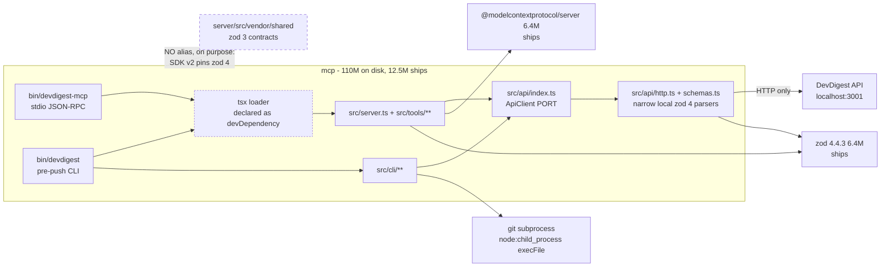

# Dependency audit - 2026-08-27

## Summary

- **Scope: `mcp` only.** The other four packages (`server`, `client`, `reviewer-core`, `e2e`) were not audited in this run.
- 110 MB on disk, of which **12.5 MB is the shipping half** (`@modelcontextprotocol/server` 6.4 MB + `zod` 6.4 MB). Everything else is toolchain.
- **The single most expensive fact: two copies of the esbuild native binary cost 20 MB, 18% of the whole tree**, because `vitest` 2.x pins esbuild 0.21 through vite 5 and `tsx` 4.x carries esbuild 0.28.
- `typescript` (23.4 MB) and `js-tiktoken` (22.0 MB) are the two largest single entries, and both are dev-only. `js-tiktoken` is 20% of the tree to serve one script, `pnpm budget`, plus the CI test that imports its counter.
- The collector found **no undeclared binaries and no unimported runtime dependencies**, which is what the isolated pnpm layout buys: `mcp` has no `.npmrc`, so unlike `server` and `client` it cannot import something it never declared.
- Both binaries in `bin/` exec `node_modules/.bin/tsx`, so the process needs a third package at runtime that is declared under `devDependencies`.
- Licences were not reviewed and no network checks were run, so advisories and staleness are unmeasured (see `not_run`).

## Since the last audit

Baseline: `deps-2026-08-20.md`, same `mcp`-only scope.

- **Still open (2 audits):** `js-tiktoken-drift`. Unchanged in shape, and now measured more precisely: both packages have 1.0.21 installed today, so the drift is in the declared floor only.
- **New:** `tsx-runtime-classified-dev`, `esbuild-duplicated`, `mcp-no-git-rule-overclaims`.
- **Gone:** none. Nothing from the baseline was dropped or silently resolved.
- **Size:** `disk_mb` 110 to 110, a 0% move. `declared` 9, `ships` 2, `installed_top_level` 8 and `layout` isolated are all unchanged.
- **Cleared:** `zod` carries forward with the same reason. Four candidates were checked and cleared for the first time this run.

## Map

The subject is one package, so this is that subtree rather than all five.
The edge that matters most is the one that is not there: `mcp` is the only package in the repo with no `paths` alias to `@devdigest/shared`.



## Weight

Sizes below are each package's **own files**, resolved through the pnpm symlink.
They do not include the dependency's own subtree, so they do not sum to the tree total (see the collector's notes).
Tree total for `mcp`: **112,676 KB (110 MB)** across 111 entries in the isolated store.

| Dependency | Class | Own size | Imported from | Verdict |
|---|---|---|---|---|
| `typescript` | dev | 23.4 MB | never imported | `pnpm typecheck` only |
| `js-tiktoken` | dev | 22.0 MB | `scripts/token-budget.ts` | dev script + its CI test |
| `@modelcontextprotocol/client` | dev | 6.5 MB | `test/**`, `scripts/**` | correct as dev |
| `zod` | **ships** | 6.4 MB | `src/**` | runtime |
| `@modelcontextprotocol/server` | **ships** | 6.2 MB | `src/**` | runtime |
| `@types/node` | dev | 2.5 MB | types only | correct as dev |
| `vitest` | dev | 1.9 MB | `test/**` | correct as dev |
| `dependency-cruiser` | dev | 1.6 MB | never imported | `pnpm arch:check` binary |
| `tsx` | dev | 0.7 MB | never imported | **but exec'd by both binaries** |

The heaviest things that actually ship are just the two runtime dependencies, **12.5 MB combined**.
The other 97 MB is toolchain and never leaves a developer machine.

What the tree total is actually made of, largest first:

| Store entry | Size | Pulled in by |
|---|---|---|
| `typescript@5.9.3` | 23.4 MB | direct dev |
| `js-tiktoken@1.0.21` | 22.0 MB | direct dev |
| `@esbuild/darwin-arm64@0.28.2` | 10.4 MB | `tsx` |
| `@esbuild/darwin-arm64@0.21.5` | 9.6 MB | `vitest` via `vite` 5 |
| `@modelcontextprotocol/client@2.0.0` | 6.5 MB | direct dev |
| `zod@4.4.3` | 6.4 MB | direct, ships |
| `@modelcontextprotocol/server@2.0.0` | 6.2 MB | direct, ships |
| `vite@5.4.21` | 3.2 MB | `vitest` |
| `rollup@4.62.4` + `@rollup/rollup-darwin-arm64` | 4.5 MB | `vitest` via `vite` |

**Not a finding, so that it is not misread as one:** the collector reports `declared: 9` against `installed_top_level: 8`.
Nothing is missing. `@modelcontextprotocol/client` and `@modelcontextprotocol/server` share one `@modelcontextprotocol/` scope directory, which counts once.

## Findings

### Weight

#### esbuild is installed twice, 20 MB, 18% of the tree - low

`mcp/node_modules/.pnpm` holds `@esbuild/darwin-arm64@0.21.5` (9.6 MB) and `@esbuild/darwin-arm64@0.28.2` (10.4 MB).
Nothing declares esbuild directly: `vitest` 2.1.x reaches it through `vite` 5, and `tsx` 4.19 carries its own.
The two ranges do not overlap, so pnpm is correct to keep both.

Why it matters here: this is the largest single lever on install time and store size for the package, and it is pure duplication rather than anything the package uses.
Why it is only low: it is dev-only weight on a private package that is never published and never installed in CI as a production tree, so nothing ships and nothing breaks.

The ignored postinstall on both copies was checked and is intended, not a defect: pnpm reports "Ignored build scripts: esbuild" and `mcp/INSIGHTS.md` records that `tsx` and `vitest` both still work because esbuild delivers its binary as a platform-specific optional dependency, so `pnpm approve-builds` is explicitly the wrong fix.

Fix: none available today by itself. Deduplication needs `vitest` and `tsx` to land on the same esbuild minor, which no currently available bump guarantees.
Re-check it at the next `vitest` major rather than attempting a bump now.

### Hygiene

#### `tsx` is a runtime requirement declared under devDependencies - low

`mcp/bin/devdigest-mcp` and `mcp/bin/devdigest` both end in `exec "$here/node_modules/.bin/tsx" ...`.
That makes `tsx` a third thing the process needs to start, while `package.json` lists it under `devDependencies` and both `mcp/AGENTS.md` and the `mcp-has-no-db-or-framework` comment in `.dependency-cruiser.cjs` state the package "has exactly two runtime dependencies (the MCP SDK and zod)".

Both statements are true about *imports*, which is what the depcruise rule measures, and false about the *process*.
Why it matters here: the `ships: 2` number in this report and in the machine block reads as "a production install would run", and it would not.

Why it is only low: the package is `"private": true` and is never installed without devDependencies, and both launchers already handle the missing-loader case explicitly with a diagnostic on stderr and a non-zero exit rather than a stack trace.

Fix, pick one: move `tsx` to `dependencies`, or amend the two sentences to say "two imported runtime dependencies, plus the `tsx` loader the launchers exec".
The second is one line in each of two files and keeps the dependency classification honest to how the package is actually installed.

#### `js-tiktoken` declared floor drifts from `server` - low

`mcp` declares `^1.0.15`, `server` declares `^1.0.21`.
Carried over from the 2026-08-20 audit and still open.

Measured this time: both trees have **1.0.21 installed**, and both lockfiles are committed, so there is no live divergence.
The exposure is a fresh resolution against a new lockfile landing the two on different encodings.

Why that matters here specifically rather than as generic hygiene: `mcp/scripts/token-budget.ts` names `server/src/adapters/tokenizer/index.ts` as the reason it picked `cl100k_base`, and both sides count tokens against fixed budgets.
The two are meant to agree by construction, and only the declared range says so.

Fix: raise `mcp` to `^1.0.21` so the floor matches what is installed and what `server` declares. One line, no install behaviour change today.

### Boundaries

#### `mcp-has-no-db-or-framework` claims more than it enforces - low

The rule in `mcp/.dependency-cruiser.cjs` reads "No database, HTTP framework, git or GitHub client in this process", and its `to.path` bans the packages `drizzle-orm`, `drizzle-kit`, `postgres`, `pg`, `fastify`, `octokit`, `@octokit` and `simple-git`.

`mcp/src/cli/git.ts` runs git in this process through `node:child_process` `execFile`, which the rule permits because it bans a package name and not a capability.

The CLI's git use is deliberate and carefully done: `execFile` and never a shell, `--no-ext-diff` on every diff so a hostile repository's `diff.external` is not executed, a 64 MB `maxBuffer` so a large diff cannot be silently truncated, and untracked files excluded and reported.
So this is not a security finding.

Why it matters: `pnpm arch:check` is the mechanical statement of this package's boundaries, and a reader who trusts the comment gets a claim broader than the check.
That is exactly the kind of gap this audit's boundaries dimension exists to name.

Fix: narrow the comment to what it enforces, and say why the CLI is the exception. One line in `mcp/.dependency-cruiser.cjs`.

## Priority

Ranked by payoff per unit of effort, not by severity.

| # | Action | Dimension | Effort | Payoff |
|---|---|---|---|---|
| 1 | Raise `js-tiktoken` to `^1.0.21` in `mcp/package.json` | hygiene | one line | Closes a two-audit finding and keeps the two token counters on one encoding by declaration |
| 2 | Reconcile the "exactly two runtime dependencies" claim with `tsx`, in `AGENTS.md` and `.dependency-cruiser.cjs` (or move `tsx` to `dependencies`) | hygiene | two lines | The declared runtime set stops contradicting what `bin/` executes |
| 3 | Narrow the `mcp-has-no-db-or-framework` comment to what it bans, noting the CLI's deliberate `execFile` git | boundaries | one line | `arch:check` stops asserting a boundary it does not check |
| 4 | Re-check esbuild deduplication at the next `vitest` major | weight | deferred | Up to 10 MB and a slice of install time, dev-only, and not achievable today |

## Machine summary

```json
{
  "schema": "dependency-audit/1",
  "packages": [
    {
      "name": "mcp",
      "disk_mb": 110,
      "layout": "isolated",
      "declared": 9,
      "ships": 2,
      "installed_top_level": 8
    }
  ],
  "findings": [
    {
      "id": "js-tiktoken-drift",
      "subject": "js-tiktoken",
      "package": "mcp",
      "dimension": "hygiene",
      "severity": "low"
    },
    {
      "id": "tsx-runtime-classified-dev",
      "subject": "tsx",
      "package": "mcp",
      "dimension": "hygiene",
      "severity": "low"
    },
    {
      "id": "esbuild-duplicated",
      "subject": "esbuild",
      "package": "mcp",
      "dimension": "weight",
      "severity": "low"
    },
    {
      "id": "mcp-no-git-rule-overclaims",
      "subject": "mcp-has-no-db-or-framework",
      "package": "mcp",
      "dimension": "boundaries",
      "severity": "low"
    }
  ],
  "cleared": [
    {
      "subject": "zod",
      "package": "mcp",
      "why": "deliberate zod 4 split, documented in CLAUDE.md"
    },
    {
      "subject": "@modelcontextprotocol/client",
      "package": "mcp",
      "why": "devDependency imported only from test/** and scripts/token-budget.ts, never from src/**"
    },
    {
      "subject": "dependency-cruiser",
      "package": "mcp",
      "why": "never imported; used as the pnpm arch:check binary, so devDependency is correct"
    },
    {
      "subject": "typescript",
      "package": "mcp",
      "why": "largest entry in the tree at 23.4 MB but never imported and never shipped; pnpm typecheck only"
    },
    {
      "subject": "@modelcontextprotocol/*",
      "package": "mcp",
      "why": "declared 9 vs installed_top_level 8 is scope-directory counting, not a missing install"
    }
  ],
  "not_run": [
    "advisories",
    "staleness",
    "licenses"
  ]
}
```
