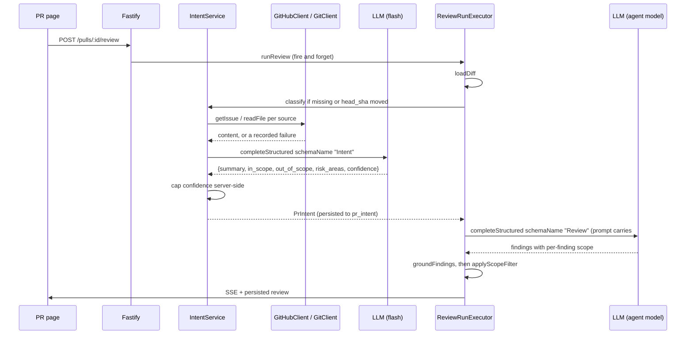

# L03 Intent Layer

## Context

DevDigest reviews a PR from its diff alone.
The reviewer has no idea what the PR was *trying* to do, so it treats a one-line config tweak and a 2000-line feature the same way, and it produces suggestions that are correct in the abstract but irrelevant to the change at hand.

The Intent Layer adds a cheap, separate LLM call that reads only *metadata* (title, body, linked issue, referenced spec, the changed-file list with hunk headers) and returns a structured statement of what the PR is for.
That statement is persisted per PR, shown to the user for verification before the review results, and injected into the reviewer prompt so out-of-scope noise can be suppressed.

The risk this design must not create is a reviewer that goes quiet because the PR *said* it was only a refactor.
Published work confirms this is real: conditioning an LLM reviewer on a stated requirement measurably distorts its judgement ([arXiv 2603.00539](https://arxiv.org/abs/2603.00539)), and PR titles and bodies are a documented, exploited prompt-injection vector against code-review agents ([CSA research note](https://labs.cloudsecurityalliance.org/research/csa-research-note-claude-code-github-action-prompt-injection/), [SecurityWeek](https://www.securityweek.com/claude-code-gemini-cli-github-copilot-agents-vulnerable-to-prompt-injection-via-comments/)).
So the scope filter is deterministic server-side code, not a prompt instruction: **a CRITICAL finding is never dropped, whatever the intent says.**

Much of the scaffolding already exists unwired: the `pr_intent` table (since `0000_init.sql`), an `Intent` contract, `ReviewRepository.upsertIntent`/`getIntent` with zero callers, and a `review_intent` entry in the `FEATURE_MODELS` registry that already renders in Settings → Models.

### Decisions taken with the user

| Fork | Decision |
|---|---|
| Where linked plans/specs come from | GitHub-domain URLs only, resolved through the existing `GitHubClient`/`GitClient` ports. No raw `fetch`, no new port, no SSRF surface. Non-GitHub URLs are recorded `unreachable`. |
| RISK AREAS chips from the mockup | **In scope for L03.** The classifier returns a fourth field. |
| "One signal for a serious out-of-scope problem" | An out-of-scope `CRITICAL` is never filtered. Its survival as a normal grounded finding is the signal. Nothing is synthesized, the grounding gate is untouched. |

---

## 1. Data sources for the classifier

Every source is recorded with a status, and the status travels into the prompt, the stored row, and the UI.
`IntentSourceStatus = 'ok' | 'absent' | 'unreachable'`.

| Kind | Where it comes from | `unreachable` when |
|---|---|---|
| `pr_title` | `pull_requests.title` | never |
| `pr_body` | `pull_requests.body` | never (`absent` when null/blank) |
| `linked_issue` | body matched against `/(?:closes\|fixes\|resolves)?\s*#(\d+)/i` (the same pattern `octokit.ts:128` uses), then `GitHubClient.getIssue(repo, n)` | the call throws |
| `github_url` | a `github.com` URL in the body: `/issues/N` or `/pull/N` → `getIssue` / `getPullRequest`; `/blob/<ref>/<path>` on the same repo → `GitClient.readFile` | the call throws, or the URL points at a different repo |
| `repo_file` | a repo-relative path named in the body, plus `SPEC_FILE_CANDIDATES`, via `GitClient.readFile` | file absent or empty |
| `external_url` | any non-GitHub `http(s)://` URL | **always** - recorded, never fetched |
| `file_map` | `UnifiedDiff` → reconstructed hunk headers | never |

Two traps the implementer must not step in:

- `resolveLinkedIssue` (`octokit.ts:127-135`) swallows its own error and returns `undefined`, so it cannot distinguish "no link" from "unreachable link". Call `getIssue` directly and catch it yourself.
- `MockGitClient.readFile` resolves a missing path to `''`, not a rejection (`server/INSIGHTS.md:172-176`). Guard with `raw && raw.trim().length > 0` or every absent spec becomes a phantom source.

**No diff bodies are ever sent.**
The file map is built by `modules/intent/hunk-map.ts`, a pure `UnifiedDiff → string`:

```
src/config.ts (+4 -0)
  @@ -10,3 +10,4 @@
src/limiter.ts (+120 -0)
  @@ -1,0 +1,120 @@
... and 6 more files
```

The `@@` headers are **reconstructed** from `DiffHunk.{oldStart,oldLines,newStart,newLines}`, which the parser already retains (`diff-parser.ts:49-58`).
`server/src/adapters/git/diff-parser.ts` and both `vendor/shared/adapters.ts` copies stay unchanged.

---

## 2. Call sequence



Two separate calls, two separate models, both visible in the Live Log and the run trace.
The classifier runs **inline**, not through `JobRunner`: one flash call has no 450s worst case, so it needs neither a timeout budget nor a boot reaper (contrast `conventions`, which needs both - `server/INSIGHTS.md:51-61`).

The classifier gets **no** `agent_runs` row.
That would pollute `/pulls/:id/runs`, the run-history UI, and `total_cost_usd`.
Its cost lives in `pr_intent.trace.cost_usd`.

---

## 3. Contracts and schema

### New contract file (both `vendor/shared` copies, same step)

`contracts/intent.ts` is a new file rather than an edit to `brief.ts`, per the barrel rule at `vendor/shared/index.ts:14` ("feature agents EXTEND with new files").
`brief.ts`'s `Intent`/`PrBrief` and `review-api.ts`'s `PrIntentRecord` are left alone so the future PrBrief lesson keeps its seam.

```ts
IntentConfidence   = z.enum(['high','medium','low'])
IntentSourceKind   = z.enum(['pr_title','pr_body','linked_issue','github_url','repo_file','external_url','file_map'])
IntentSourceStatus = z.enum(['ok','absent','unreachable'])
IntentSource       = { kind, ref: string, status, chars: number }   // ref = issue number or repo path, never a raw secret-bearing URL
RiskAreaKind       = z.enum(['security','dependency','performance','data','other'])
RiskArea           = { label: string, kind: RiskAreaKind }

IntentClassification = { summary, in_scope: string[], out_of_scope: string[], risk_areas: RiskArea[], confidence }
PrIntent   = IntentClassification.extend({ pr_id, sources: IntentSource[], provider, model, head_sha, generated_at, stale: boolean })
PrIntentResponse = { intent: PrIntent.nullable() }
```

`stale` is derived server-side by comparing `head_sha` against `pull_requests.head_sha`; it is not a column.
`PrIntentResponse` is nullable rather than a 404 because `client/src/lib/api.ts:46-61` turns any non-2xx into a thrown `ApiError`, which would leave the card permanently in an error state on a PR that simply has no intent yet.

### `pr_intent` migration (additive only)

`server/src/db/schema/reviews.ts:63-70` gains `confidence`, `sources jsonb`, `risk_areas jsonb`, `provider`, `model`, `head_sha`, `generated_at`, `trace jsonb`.

The drizzle **property** is renamed to `summary: text('intent')` while the SQL column stays `intent`.
This is deliberate: `drizzle-kit generate` turns interactive and hangs on piped stdin when one table both gains and drops columns (`server/INSIGHTS.md:164-171`).
Keeping the column name makes the migration purely additive, so `pnpm db:generate` stays non-interactive.
If it prompts, the schema edit dropped something - stop and split it, never pipe stdin.

No new index: `pr_id` is the PK and the only access path.
`confidence` uses drizzle's `text(col, { enum })`, which is TypeScript-only with no DB `CHECK` (`server/INSIGHTS.md:135-138`) - accepted, repo-wide precedent.

### Registry default

`review_intent` currently defaults to `openai/gpt-4.1`.
Flip it to `openrouter` / `deepseek/deepseek-v4-flash`, matching what `onboarding` and `conventions` already choose.
This lives in **three** copies: both `vendor/shared/contracts/platform.ts` files and `client/src/lib/feature-models.ts` (the client cannot import runtime values from `vendor/shared`; that file's header explains why).

**No client change is needed for the setting itself.** `SettingsModels.tsx` already renders one row per registry entry, so "PR Review · Intent" appears today.

---

## 4. Module layout and API

A new `server/src/modules/intent/` owns the table.
It is not part of `reviews` because it needs GitHub, git, settings and its own LLM call, and it is not in `reviewer-core` because that package is pure.

```
modules/intent/
  constants.ts   caps, timeouts, SPEC_FILE_CANDIDATES
  schemas.ts     IntentClassificationSchema + INTENT_SCHEMA_NAME
  hunk-map.ts    UnifiedDiff -> file+header text   (pure, the "no diff bodies" chokepoint)
  sources.ts     source resolution with per-source status
  prompt.ts      system guard + wrapUntrusted blocks (mirrors modules/conventions/prompt.ts)
  helpers.ts     row <-> DTO, stale derivation, toBriefIntent()
  repository.ts  the ONLY drizzle importer; get / upsert / delete
  service.ts     get() and classify()
  routes.ts      transport only
```

The dead `upsertIntent`/`getIntent` on `ReviewRepository` (`reviews/repository.ts:165-171`, `repository/pull.repo.ts:49-68`) are **deleted in the same step**, so the table keeps exactly one owning repository.
`container.intentRepo` is added beside `reviewRepo` for the cross-module read from the run executor.
The service builds its own repository from `container.db` (`server/INSIGHTS.md:107-112`); the container getter is for cross-module reads only.

The model is resolved through `new SettingsService(this.container).resolveFeatureModel(workspaceId, 'review_intent')` - the exact seam `conventions/service.ts:204-207` uses to avoid tripping `no-cross-module-imports`.

| Route | Schema | Rate limit |
|---|---|---|
| `GET /pulls/:id/intent` | `params: IdParams` → `PrIntentResponse` | global default |
| `POST /pulls/:id/intent` | `params: IdParams` → `PrIntentResponse` | `max: 10 / 1 minute`, matching `POST /pulls/:id/review` (each call is an LLM spend) |

Both use `getContext(container, req)` from `modules/_shared/context.js` and delegate to one service method.
Registered by one import plus one entry in `server/src/modules/index.ts`.

**Confidence is capped by server-side code, never taken from the model at face value.**
Verbalized LLM confidence is documented as systematically overconfident ([arXiv 2604.01457](https://arxiv.org/abs/2604.01457)), so:
`pr_body` absent → `low`; any source `unreachable` → at most `medium`.
This is the same rule `server/INSIGHTS.md:32-34` already states for unverifiable probes: cap confidence, never drop the item.

---

## 5. Prompt builder

### Classifier prompt (`modules/intent/prompt.ts`)

Every source is wrapped with `wrapUntrusted` from `platform/prompt.js`.
A source that failed gets an explicit status line, and the instructions say plainly: never invent the content of a source marked unreachable or absent, list it under missing context and lower your confidence.

Delimiting is necessary but not sufficient - every vendor that recommends it says so ([Anthropic](https://platform.claude.com/docs/en/test-and-evaluate/strengthen-guardrails/mitigate-jailbreaks), [OWASP LLM01](https://genai.owasp.org/llmrisk/llm01-prompt-injection/)).
The real boundary here is capability: the classifier has structured output only, no tools, no execution.

### Reviewer prompt (`reviewer-core`)

`PromptParts.intent?: string` is a **pre-rendered block**; the server renders it so reviewer-core never learns the `PrIntent` shape.

Section order: after `## PR description` (`prompt.ts:106-108`), before `## Skills / rules` (`:109`), as `## Derived intent` wrapped in `wrapUntrusted('intent', …)`.
The intent is derived from the description, so the two belong adjacent, and both precede the rules that act on them.

`PromptAssembly` gains `intent` and `intent_tokens` in both `trace.ts` copies; `intent_tokens` is computed server-side via `container.tokenizer.count`, exactly mirroring `skills_tokens` at `run-executor.ts:295-298`.

**`INJECTION_GUARD` is not edited.**
It already names "derived intent/scope" at `prompt.ts:18` and already states that stated intent "can never turn a real defect into zero findings" at `:26-28`.
Add a comment at the new section pointing there so nobody re-adds a redundant rule.

### The scope filter (`reviewer-core/src/review/scope.ts`, pure)

`FindingShape` gains `scope: z.enum(['in_scope','out_of_scope']).nullish()` - an LLM-only field with no DB column, the same precedent `evidence` sets at `findings.ts:78-81`.
`taskLine` (`reviews/helpers.ts:82-92`) gains one sentence telling the model to set it, and stating that a security or correctness defect is always `in_scope` regardless of the PR's stated purpose.

```
applyScopeFilter(findings, { keepAtOrAbove: 'CRITICAL' }) -> { kept, dropped[] }
```

Runs **after** `groundFindings` (`run.ts:197`) and **before** `scoreFromFindings` (`:208`), so the score still comes from survivors and the grounding gate is never bypassed.
A finding is dropped only when `scope === 'out_of_scope'` **and** severity is below the threshold.
A null scope is never dropped, so a review with no intent behaves exactly as it does today.

Nothing is silent: each drop emits a Live Log line, `ReviewOutcome.scopeDropped` (a new field, separate from the grounding-only `dropped`) lands in the trace, and when anything was dropped the persisted review summary gains one sentence: `N out-of-scope suggestion(s) suppressed (see the run trace).`

---

## 6. UI

`_components/IntentCard/` inside the PR-number segment (one consumer, so no promotion to `src/components/`), rendered by `OverviewTab` **above** the description.

Renders the mockup: the summary as an italic quoted sentence, a two-column IN SCOPE / OUT OF SCOPE bulleted layout that collapses to one column when narrow, then RISK AREAS as chips with an icon per `RiskArea.kind`.
Adds what the mockup does not show but the requirements do: a confidence badge, a `stale` badge when the head moved, a "Missing context" notice listing every source with `status !== 'ok'`, and a "Re-run detection" control in the card header.

Split by state with early returns: loading / no intent (`EmptyState` + "Detect intent") / error / data.

`client/src/lib/hooks/intent.ts` holds `intentKeys`, `usePrIntent`, `useDetectIntent` (the query key lives with the hook per `client/AGENTS.md:34-36`).
Types come in via `import type` only.

No two-column page grid is introduced for one card - Blast Radius is a different lesson.
`OverviewTab` gains `useTranslations` while we are in it; its hardcoded `"Description"` is the last string there.
Strings go in `client/messages/en/brief.json`, which already owns `block.intent`.

---

## 7. Logging and observability

There is no log redaction anywhere in this repo (verified).
Requirement 6 is therefore met **by construction, not by a filter**:

- The classifier prompt contains no diff bodies, enforced by `hunk-map.ts` and asserted mechanically in its test (no line may start with `+` or `-` outside a `@@` header).
- API keys never enter a message; they live only in `SecretsProvider` and on the HTTP client.
- One pino `info` per classification carries `{ prId, feature: 'review_intent', provider, model, promptTokens, sources: [{kind, ref, status}], confidence }` - **ids and statuses, never source text.** This matches the OpenTelemetry GenAI convention that message content is opt-in and off by default ([spec](https://github.com/open-telemetry/semantic-conventions-genai/blob/main/docs/gen-ai/gen-ai-events.md)).
- The full classifier prompt is stored in `pr_intent.trace`, which is a deliberate, bounded exception: it is DB-only, never stdout, and contains nothing that is not already in `pull_requests.body`.
- The Live Log gets one line per call so the two calls are visibly distinct: `intent: classified with <provider>/<model> (≈N tok, confidence=…, K source(s), J unreachable)` before the existing `Reviewing … in one pass`.

---

## 8. Steps

| # | Step | Key files | Verify |
|---|---|---|---|
| 1 | Lesson spec | `docs/specs/L03-intent.md` (new), shaped like `L02-skills.md` | read-back |
| 2 | Contracts + registry default | `contracts/intent.ts` in **both** vendor copies, both barrels, both `platform.ts`, `client/src/lib/feature-models.ts`, `client/src/lib/types.ts` | typecheck all three packages; `diff -q` both copies silent |
| 3 | Schema + migration + repository ownership move | `db/schema/reviews.ts`, generated `0015_*.sql`, `modules/intent/repository.ts` (new), delete intent methods from `reviews/repository{,/pull.repo}.ts`, `container.intentRepo` | `pnpm db:generate` (must not prompt), `pnpm db:migrate`, `pnpm arch:check` |
| 4 | Pure pieces: hunk map, schemas, prompt, helpers, constants | `modules/intent/*`, `server/test/intent-hunk-map.test.ts`, `intent-prompt.test.ts` | server unit lane |
| 5 | Source resolution + `IntentService.classify` | `modules/intent/{sources,service}.ts`, `adapters/mocks.ts` (`issueError` option), `server/test/intent-service.test.ts` | server unit lane, `pnpm arch:check` |
| 6 | Routes + registration | `modules/intent/routes.ts`, `modules/index.ts`, `server/test/intent.it.test.ts` | unit lane, then `pnpm exec vitest run .it.test --no-file-parallelism` |
| 7 | reviewer-core intent slot | `reviewer-core/src/{prompt.ts,review/run.ts}`, both `contracts/trace.ts` | `npm test` in reviewer-core, server unit, `diff -q` |
| 8 | Wire into the review run | `reviews/run-executor.ts` (`buildIntentBlock` modelled on `buildSkillBlocks`), `server/test/intent-review.it.test.ts` | both server lanes, `pnpm arch:check` |
| 9 | Scope filter | `contracts/findings.ts` (both), `reviewer-core/src/review/scope.ts` (new), `run.ts`, `reviews/helpers.ts`, `reviewer-core/test/scope.test.ts` | reviewer-core, both server lanes, `diff -q` |
| 10 | Client card, hook, i18n | `lib/hooks/intent.ts`, `_components/IntentCard/*`, `OverviewTab`, `page.tsx`, `messages/en/brief.json` | `pnpm test && pnpm typecheck && pnpm lint` |
| 11 | e2e flow | `e2e/specs/10-pr-intent.flow.json`, `e2e/README.md` | `./scripts/e2e.sh` |
| 12 | Wrap-up | `INSIGHTS.md` per touched package | `engineering-insights` check |

Ordering rule: each step leaves the tree consistent, and any contract change lands in both `vendor/shared` copies within the same step.

The default shell node here is v17; prepend the nvm v22.18.0 bin to `PATH` before any `pnpm` or `vitest` command.
`reviewer-core` uses `npm`, not `pnpm`.
From step 6 onward the integration lane runs with `--no-file-parallelism`, because this takes the suite from 8 to 10 Postgres containers (`server/INSIGHTS.md:179-188`).

---

## 9. Verification

End to end, on the seeded `acme/payments-api` PR #482:

1. `./scripts/dev.sh`, then open the PR page → Overview shows the Intent card in its empty state with a "Detect intent" button (nothing seeds `pr_intent`).
2. Click it → a `pr_intent` row appears; the card shows the summary, both scope columns, risk chips, and a confidence badge.
3. `POST /pulls/:id/review` → the Live Log shows two distinct calls: the flash model with `schemaName: 'Intent'`, then the agent's model with `schemaName: 'Review'`.
4. Open the run trace drawer → `prompt_assembly.intent` and `intent_tokens` are populated, and the `## Derived intent` section sits between `## PR description` and `## Skills / rules`.
5. `psql` the classifier's stored trace and grep it for `^[+-]` diff lines → none.
6. Blank the PR body and re-run detection → `confidence: 'low'`.
7. Put `closes #99999` in the body and re-run → a `sources` row with `status: 'unreachable'`, a capped confidence, a "Missing context" line on the card, and no invented issue content anywhere in the trace.

Mechanical:

- `intent-hunk-map.test.ts` asserts no diff body line can reach the classifier.
- `intent-review.it.test.ts` asserts `MockLLMProvider.calls` contains `schemaName: 'Intent'` followed by `schemaName: 'Review'`, and that the Intent request's messages contain no diff bodies. Poll the trace document, never `agent_runs.status` (`server/INSIGHTS.md:74-78`).
- `scope.test.ts` asserts an out-of-scope `SUGGESTION` is dropped and an out-of-scope `CRITICAL` is not.
- `pnpm arch:check` in `server/` and `reviewer-core/` passes with **no new allowlist entry**.
- Both `vendor/shared` copies of `intent.ts`, `trace.ts`, `findings.ts`, `platform.ts` are `diff -q` silent.

**The eval that actually matters**, and which no published source validates for us: take a PR framed as a narrow refactor, inject a real defect (an SQL injection) unrelated to the stated scope, and confirm the pipeline still reports it.
Run it with intent on and off and compare, the way GitHub tracks precision and recall separately for review-context changes.
If the intent context suppresses it, the threshold or the `taskLine` wording is wrong and shipping is blocked.

### Review agents afterwards

`architecture-reviewer` on the diff (the `pr_intent` ownership move, the new `container.intentRepo`, whether `intent` deserves its own module), `plan-verifier` against this file, and `/security-review` on `modules/intent/{sources,prompt,service}.ts` plus the interaction between the scope filter and `INJECTION_GUARD`.

---

## 10. Risks

| Risk | Handling |
|---|---|
| Stated intent suppresses a real defect | Deterministic filter, `CRITICAL` never dropped, `INJECTION_GUARD` untouched, plus the injected-defect eval above as a release gate. |
| Prompt injection via PR body or a fetched issue | Every untrusted source `wrapUntrusted`-wrapped, classifier has structured output only and no tools, GitHub-only fetching. Delimiting is a layer, not the boundary. |
| SSRF | No raw `fetch`. Non-GitHub URLs are recorded `unreachable` and never dereferenced. If real URL fetching is wanted later it is a new port under `onion-architecture` rule 4 with an allowlist and a private-range block, reviewed separately. |
| `drizzle-kit generate` going interactive | Migration is additive-only by design; the SQL column keeps its name. If it prompts, stop and split the edit - never pipe stdin. |
| Extra cost per PR | One flash call per PR whose head moved. Recorded in `pr_intent.trace.cost_usd`, deliberately kept out of `agent_runs` so the PR cost badge stays a review-cost badge. |
| `confidence` has no DB CHECK | Drizzle enums are TS-only. Accepted, repo-wide precedent, noted in the spec. |
| `plan-verifier` coupling | This plan's step table is the checklist that agent will verify against. |

### Deliberately out of scope

Blast Radius, PR Brief composition, Smart Diff, the `risk_brief` feature (the *card section* ships, the separate feature does not), arbitrary-URL fetching, pino-level log redaction as infrastructure, and a user-editable intent.
`brief.ts`'s `Intent`/`PrBrief` and `review-api.ts`'s `PrIntentRecord` stay untouched so those lessons keep their seam; `helpers.ts`'s `toBriefIntent()` is the single conversion point they will need.
