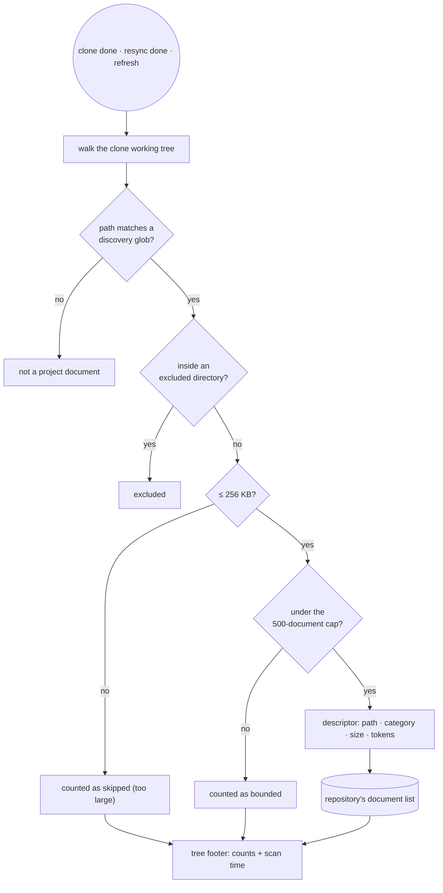
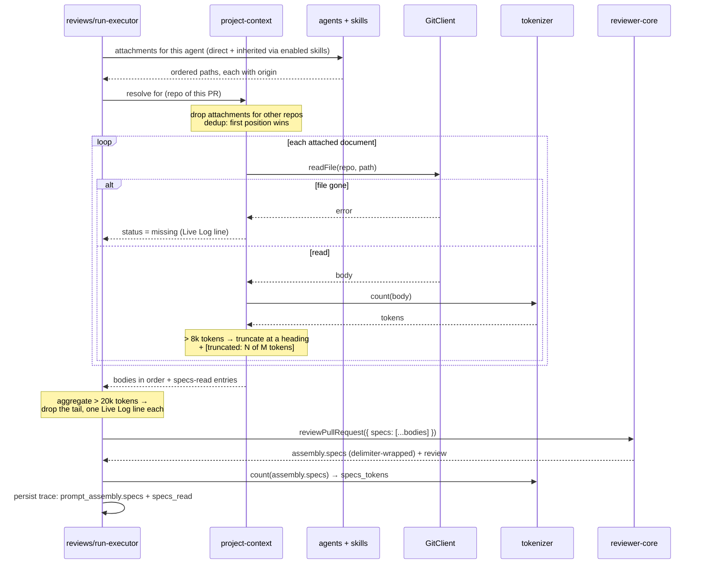

# Spec: Project Context

Spec ID: L05
Status: approved
Supersedes: none

## Problem and user

The user is a developer running DevDigest against an imported repository, configuring agents in the Skills Lab and reading agent runs on a pull request.

That repository already contains the project's written truth: PRDs, specs, a security baseline, architecture notes, incident write-ups.
An agent reviewing `#482 Add rate limiting to public API endpoints` today has the diff, the repo skeleton, the PR description, the derived intent and its skills - and knows nothing about what `specs/rate-limiting.prd.md` says the limiter must do, or that `specs/public-api.md` forbids exposing internal account IDs.
The reviewer finds generic defects and misses the ones that only exist relative to the project's own rules.

The workaround is manual and lossy: the user copies the relevant paragraph out of a document and pastes it into a skill body.
That copy has no provenance, drifts the moment the document changes, is invisible in the token accounting, and has to be repeated for every agent that needs it.

The gap is not in the engine.
`reviewer-core` already accepts a `specs` input, renders it as a `## Project context` section with each entry delimiter-wrapped, and records it in `PromptAssembly.specs`; `RunTrace` already carries `specs_read`; the trace drawer already renders both.
Nothing ever fills them.
L05 fills that seam and builds the browsing, attachment and accounting around it.

## Goals and non-goals

### Goals

1. The user can browse every Markdown document the imported repository carries under the known documentation roots, and read any of them in the product.
2. The user can attach chosen documents to an agent, and to a skill, in an explicit order that determines the order they appear in the prompt.
3. The user can see, before running anything, how many tokens each document adds and how many tokens the whole attachment set adds to every run of that agent.
4. A run injects the attached documents' full text into the prompt, inside the existing `## Project context` block, delimiter-wrapped as untrusted data.
5. Opening a completed run's trace shows a `Project context - attached specs (untrusted)` segment carrying the exact text that was sent, plus a per-document record of what was read, skipped or truncated.

### Non-goals

- **Editing, creating, uploading, renaming or deleting documents.**
  Documents are read-only mirrors of the clone.
  `server/clones/**` is do-not-touch, the `GitClient` port has no write or commit method, and `sync()` fast-forwards the working tree, so an edit written into the clone is destroyed on the next resync.
  The mockup's `+ new`, `new folder` and `upload` toolbar actions are therefore out of scope; `refresh` is the only toolbar action that ships.
  DevDigest-owned document storage is a separate feature, deferred rather than rejected.
- **Committing anything to git.**
  Nothing in this feature writes to a working tree or creates a commit.
- **Embeddings and semantic retrieval over documents.**
  The user attaches whole documents by name; nothing is chunked, embedded or retrieved by similarity.
  The mockup's "1,240 chunks" is replaced by a document count and a token total.
- **Per-repository configuration of the discovery globs.**
  The glob set is fixed in L05.
- **A coverage score.**
  The mockup's `78 COVERAGE` ring is cut; only the usage count survives.
- **Versioning attachments.**
  Changing an agent's attachments does not bump `agents.version` and does not snapshot the document list, unlike the skill links of L02.
- **A new MCP tool.**
  The five shipped tools are untouched.
- **Injecting documents into non-review LLM calls** (intent derivation, conventions extraction, onboarding).
  Project context reaches the review call only.

## User stories

- As a developer, I want to see every spec and doc my repo carries, in one place, so I stop guessing what the project has written down.
- As a developer, I want to open `specs/public-api.md` and read it without leaving the review tool.
- As a developer, I want to attach `security-baseline.md` and `public-api.md` to my Security Reviewer so every one of its reviews knows the rules it is reviewing against.
- As a developer, I want to attach a document to a skill instead, so every agent that uses that skill inherits the document without me repeating the attachment.
- As a developer, I want to know that attaching a document costs me roughly 184 tokens on every run, before I attach it.
- As a developer, I want to open a run's trace and read the exact spec text that agent was given, so a finding that cites the spec is checkable.
- As a developer, I want a document that got deleted from the repo to stop reaching my prompts, and I want to be told it happened rather than discovering it in a bad review.

## Module interactions

### Participants

| Module | Receives | Returns | On failure or unavailability |
| --- | --- | --- | --- |
| **project-context** (new server module) | A repository id, and for reads a repo-relative document path | The document list (metadata only) and single document bodies | The list is empty with a scan status; the page renders the corresponding empty, not-cloned or error state |
| **`GitClient` port** | `clonePathFor(repo)` for the scan; `readFile(repo, path)` for a body | Clone root; file content | Read failure is per-document: the viewer shows an error with retry; at run time the document is skipped and recorded as `missing` |
| **`modules/agents`** | Attachment set and order for an agent | The agent's ordered attachments, and the documents inherited from its enabled linked skills | Unreachable attachment data fails the Context tab load, not the agent editor's other tabs |
| **`modules/skills`** | Attachment set for a skill | The skill's attached documents | A globally disabled skill contributes nothing, by the same rule L02 set for skill bodies |
| **`modules/reviews`** run executor | Agent, pull request, repository | Assembled document bodies passed to the engine as `specs`, and the per-document record written into the trace | Any document that cannot be read is skipped; the run continues |
| **`reviewer-core`** | `specs: string[]` - text only, never paths | `## Project context` section with each entry wrapped by `wrapUntrusted('spec-N', …)`, plus `PromptAssembly.specs` | Empty or absent array omits the section entirely |
| **`tokenizer` adapter** | Document text | Token count | Falls back to `ceil(chars / 4)`; never throws, so a count is always available |
| **`platform/prompt-log`** | Section name, source label, token count | Metadata-only log line | Document bodies never enter this path |
| **Client** | Document list, bodies, attachment state, run trace | Project Context page, the two Context tabs, the trace segment | Each surface has its own loading, empty and error state, listed under Design review |

### Data crossing the boundaries

A **document descriptor** - what the list endpoint returns, and what both Context tabs render a row from:

| Field | Meaning |
| --- | --- |
| `path` | Repo-relative path, e.g. `specs/public-api.md`; the document's identity |
| `category` | First segment of `path` - `specs`, `docs`, `insights`, `.devdigest`; the row's tag |
| `size_bytes` | Size on disk at the last scan |
| `tokens` | Token estimate of the body at the last scan |
| `used_by_agents` | Count of distinct enabled agents that would inject this document on a run |

An **attachment** is the triple `(owner, repo, path)` plus an order index, where `owner` is one agent or one skill.
It points at a path, not at a revision: a document that changes in the repo is injected at its new content, with no re-approval.

A **specs-read entry** - one per document the run considered, persisted in the trace:

| Field | Meaning |
| --- | --- |
| `path` | Repo-relative path |
| `status` | `ok`, `missing`, or `truncated` |
| `tokens` | Tokens the document actually contributed |
| `origin` | `agent`, or `skill:<name>` for an inherited document |

`RunTrace.specs_read` is a `string[]` today, and traces persisted before L05 carry bare paths.
The contract change lands in both physical copies of `@devdigest/shared`, and old traces must still open.

`PromptAssembly` gains `specs_tokens`, matching the existing `skills_tokens` and `intent_tokens`.

### Discovery

### Assembly at run time

### Layering constraints this feature must respect

- `reviewer-core` receives **text**, never a path, a repository id or a document descriptor.
  It must not learn that project documents exist as files; it keeps taking `specs: string[]`.
- Reading the clone happens through the `GitClient` port, never through direct `fs` calls in a service.
- The new module's routes stay transport-only, its queries stay in its repository, and its attachment reads for a run cross module boundaries through `service.ts` only.
- The document list and body endpoints are workspace-scoped like every other read: a repository outside the caller's workspace is not readable.

## Acceptance criteria (EARS)

### Discovery

- **AC-1** WHEN a repository's clone completes or a resync completes, the system shall rebuild that repository's project-document list from the clone working tree.
  Observed at: the Project Context tree, whose contents match the clone after a resync that added a document.
- **AC-2** The system shall include a file in the project-document list only when its repo-relative path matches `.devdigest/**/*.md`, `docs/**/*.md`, `specs/**/*.md`, or `insights/**/*.md`.
  Observed at: the Project Context tree, where a repository-root `README.md` is absent.
- **AC-3** IF a matching file lies inside one of the excluded directories the indexer already uses, THEN the system shall exclude it from the project-document list.
  Observed at: the Project Context tree, where `node_modules/pkg/docs/api.md` is absent.
- **AC-4** IF a matching file is larger than 256 KB, THEN the system shall exclude it from the project-document list and count it as skipped.
  Observed at: the tree footer's skipped count.
- **AC-5** IF a scan matches more than 500 documents, THEN the system shall keep the first 500 in path order and report the remainder as bounded.
  Observed at: the tree footer's bounded count.
- **AC-6** The system shall set each document's category to the first segment of its repo-relative path.
  Observed at: the category tag on each Context-tab row.
- **AC-7** The system shall identify every document by its repo-relative path on every surface that names it.
  Observed at: the tree, both Context tabs, and the trace's specs-read list, which all show `specs/public-api.md`.

### Project Context page

- **AC-8** WHEN the user selects a document in the tree, the system shall render its Markdown content read-only.
  Observed at: the document viewer.
- **AC-9** The system shall offer no control that creates, edits, uploads, renames or deletes a project document.
  Observed at: the tree toolbar, which contains only refresh.
- **AC-10** WHEN the user activates refresh, the system shall re-run the discovery scan and update the footer's scan time.
  Observed at: the tree footer.
- **AC-11** WHILE the repository has no clone on disk, the system shall render a not-yet-cloned state naming the clone as the missing prerequisite.
  Observed at: the Project Context page for a repository whose clone job has not finished.
- **AC-12** IF a completed scan matched no documents, THEN the system shall render an empty state listing the four discovery globs.
  Observed at: the Project Context page for a repository with no Markdown under those roots.
- **AC-13** IF reading a selected document fails, THEN the system shall render the failure with the document's path and a retry control, and leave the tree selection unchanged.
  Observed at: the document viewer.
- **AC-14** The system shall show, for the selected document, the number of distinct enabled agents that would inject it on a run, counting an agent once whether it attaches the document directly or inherits it through an enabled linked skill.
  Observed at: the "Used by N agents" indicator in the viewer header.
- **AC-15** The system shall show, in the tree footer, the document count, the summed token estimate, and the time of the last scan.
  Observed at: the tree footer, reading "12 documents · ≈14,300 tokens · scanned 5m ago".

### Attaching documents to an agent

- **AC-16** WHEN the user toggles a document's checkbox on an agent's Context tab, the system shall persist the attachment for that agent, that repository and that path.
  Observed at: the Context tab after a page reload.
- **AC-17** WHEN the user reorders attached documents, the system shall persist the new order.
  Observed at: the Context tab after a page reload.
- **AC-18** The system shall provide a keyboard-operable reorder control on every attached row.
  Observed at: the Context tab, driven from the keyboard alone, with no pointer.
- **AC-19** The system shall show the count of directly attached documents against the count of documents available for the active repository.
  Observed at: the "N of M attached" badge.
- **AC-20** The system shall list documents inherited from the agent's enabled linked skills in a group that offers neither reorder nor detach.
  Observed at: the Context tab's inherited group.
- **AC-21** The system shall show the aggregate token estimate of every document the agent would inject, direct and inherited.
  Observed at: the Context tab footer's "≈ N tokens".
- **AC-22** WHILE that aggregate exceeds 16,000 tokens, the system shall render it in a warning state naming the 20,000-token run budget.
  Observed at: the Context tab footer.
- **AC-23** The system shall group attachments belonging to a repository other than the active one under that repository's name and mark them as not used on this repository.
  Observed at: the Context tab of an agent in a workspace with two imported repositories.
- **AC-24** IF an attached document is absent from the latest scan, THEN the system shall mark its row `missing` and keep its detach control operable.
  Observed at: the Context tab after the document is deleted from the repository and the scan re-runs.
- **AC-25** IF the document filter matches nothing, THEN the system shall render a no-match row with a control that clears the filter.
  Observed at: the Context tab's document list.

### Attaching documents to a skill

- **AC-26** WHEN the user attaches a document on a skill's Context tab, the system shall persist the attachment for that skill, that repository and that path.
  Observed at: the skill's Context tab after a page reload.
- **AC-27** The system shall render a CONTRIBUTES manifest listing each attached document's repo-relative path with its token estimate.
  Observed at: the skill Context tab, reading `- specs/public-api.md · ≈184 tok`.
- **AC-28** WHERE an agent links an enabled skill that has attached documents, the system shall include those documents' bodies in that agent's assembled project context.
  Observed at: the run trace of a review by an agent with no direct attachments and one such skill.
- **AC-29** IF a linked skill is globally disabled, THEN the system shall include none of its attached documents in any run.
  Observed at: the run trace, where the document is absent after the skill is toggled off.

### Assembly into the run

- **AC-30** WHEN a review run starts for an agent with at least one applicable attachment, the system shall read each attached document's current content from the clone and pass the bodies to the review engine as text.
  Observed at: the run trace's project-context segment, which contains the document's current text.
- **AC-31** The system shall order the assembled documents as the agent's own attachments in their stored order, followed by skill-inherited documents in the agent's skill order.
  Observed at: the order of blocks inside the trace's project-context segment.
- **AC-32** IF a document is reachable both directly and through a skill, THEN the system shall include it exactly once, at its earliest position.
  Observed at: the trace's project-context segment and its specs-read list.
- **AC-33** The system shall inject only attachments whose repository is the repository of the pull request under review.
  Observed at: the trace of a run on a second repository, whose project-context segment omits the first repository's documents.
- **AC-34** IF an attached document cannot be read at run time, THEN the system shall skip it, emit a Live Log line naming its path, and record it with status `missing`.
  Observed at: the Live Log and the trace's specs-read list.
- **AC-35** IF an attached document's token estimate exceeds 8,000, THEN the system shall truncate it at the last heading boundary that fits and append `[truncated: N of M tokens]` inside that document's block.
  Observed at: the trace's project-context segment text.
- **AC-36** IF the assembled documents exceed 20,000 tokens, THEN the system shall include documents in order until the budget is exhausted, drop the remainder, and emit one Live Log line per dropped document.
  Observed at: the Live Log and the trace's specs-read list.
- **AC-37** WHEN a review runs through the CI path rather than the studio, the system shall assemble project context by the same rules.
  Observed at: the trace of a CI-sourced run, whose project-context segment matches a studio run of the same agent on the same commit.
- **AC-38** IF an agent has no applicable attachment, THEN the system shall omit the `## Project context` section from the prompt.
  Observed at: the trace's prompt assembly, which lists no project-context segment and is otherwise identical to a pre-L05 run.

### Run trace

- **AC-39** WHEN a run completes, the system shall persist the assembled project-context text in that run's trace.
  Observed at: the trace of a completed run, whose segment text is unchanged after the underlying document is edited in the repository and rescanned.
- **AC-40** The system shall record one specs-read entry per document the run considered, carrying its path, status, token count and origin.
  Observed at: the trace's `Specs read` row and the persisted trace document.
- **AC-41** The system shall show the token count of the project-context block on its prompt-assembly segment.
  Observed at: the `≈N tok` badge on the segment, alongside the existing badges on skills and intent.
- **AC-42** The system shall place the project-context segment between the skills segment and the repo-skeleton segment, and label it as untrusted.
  Observed at: the Prompt assembly list in the run trace drawer.
- **AC-43** WHEN the user expands the project-context segment, the system shall show the full assembled text including its delimiters.
  Observed at: the expanded segment.
- **AC-44** IF a persisted trace predates this feature and carries specs-read entries without a status, THEN the system shall render them as plain paths rather than failing to open the trace.
  Observed at: the trace drawer opened on a run recorded before this feature shipped.

### Trust boundary

- **AC-45** The system shall wrap every project-document body in the engine's untrusted delimiter before it enters the prompt.
  Observed at: the trace's project-context segment, where each document is enclosed in `<untrusted source="spec-N">`.
- **AC-46** IF a document body contains the untrusted closing delimiter, THEN the system shall neutralise it so the block cannot be closed early.
  Observed at: the trace's project-context segment for a document containing `</untrusted>`.
- **AC-47** IF a document path supplied by the client resolves outside the repository's clone root, THEN the system shall reject the request and read no file.
  Observed at: the API response for a path containing `../`, and the absence of a corresponding read in the server log.
- **AC-48** IF a client-supplied document path is not present in the repository's current document list, THEN the system shall reject the request and read no file.
  Observed at: the API response for a valid-looking path to a file outside the discovery globs, such as `.env`.
- **AC-49** The system shall render document Markdown without executing embedded HTML or script, and without emitting a link whose scheme is neither `http` nor `https`.
  Observed at: the document viewer showing a document containing a `<script>` tag and a `javascript:` link.
- **AC-50** The system shall make no write to the repository clone.
  Observed at: `git status` inside the clone, which is unchanged after browsing, attaching and running.
- **AC-51** The system shall exclude document bodies from the metadata-only prompt log, recording only the section name, its source label and its token count.
  Observed at: the prompt log output for a run with attached documents.

## Edge cases

| Case | Behaviour |
| --- | --- |
| Repository not yet cloned | Not-yet-cloned state on the page (AC-11); Context tabs show zero available documents |
| Clone exists, no matching Markdown | Empty state listing the four globs (AC-12); Context tab shows "0 of 0 attached" with a link to the page |
| Exactly one document | Tree, tabs and manifest render normally; no special-casing |
| 500+ documents | List is bounded at 500 in path order (AC-5), rendered virtualised, filter always visible, attached documents pinned above unattached ones |
| Document larger than 256 KB | Never listed, counted as skipped (AC-4); it can therefore never be attached |
| Attached document deleted from the repository | Row marked `missing` (AC-24); run skips it, logs it, records it (AC-34) |
| Attached document edited in the repository | Injected at its current content, with no warning and no re-approval; the trace of the earlier run keeps the earlier text (AC-39) |
| Document changed while the user is reading it | The viewer shows a reload banner rather than swapping content under the reader |
| Same document attached directly and via a skill | Included once, at its earliest position (AC-32); both origins visible in the specs-read list |
| Agent links a skill that is globally disabled | The skill's documents are absent from the agent's inherited group and from every run (AC-29) |
| Attachment belongs to another repository | Grouped under that repository, marked not used here (AC-23), never injected (AC-33) |
| Single document over 8,000 tokens | Truncated at a heading boundary with an explicit marker (AC-35) |
| Attachment set over 20,000 tokens | Included in order until exhausted, the tail dropped and logged (AC-36) |
| Two agents attach the same document | Each agent assembles independently; the usage count reads 2 |
| Concurrent edits to the same agent's attachment set from two tabs | Last write wins; the losing tab shows the persisted set after its next load. No locking |
| A run starting while a scan is in flight | The run reads the clone directly, so it never waits on the scan and never sees a half-written list |
| Very long path or filename | The filename stays whole, the directory part is middle-truncated, and the full path is available on hover and to a screen reader |
| Document with no headings, over the cap | Truncated at the cap with the same marker; the heading-boundary rule degrades to a hard cut |
| Trace from before this feature | Opens, with paths and no status chips (AC-44) |

## Non-functional requirements

| Requirement | Number |
| --- | --- |
| Discovery scan of a repository with 500 matching documents | Completes within 5,000 ms |
| Document list response (metadata only, no bodies) | Within 200 ms for 500 documents |
| Single document body response | Within 300 ms for a 256 KB document |
| Added run setup time for 10 attached documents | Within 500 ms |
| Token estimate | Produced by the existing tokenizer adapter, with the `ceil(chars / 4)` fallback; never throws, so every document always has a count |
| Per-document prompt cost ceiling | 8,000 tokens |
| Per-run project-context ceiling | 20,000 tokens |
| Warning threshold on the Context tab | 16,000 tokens, that is 80 percent of the run ceiling |
| Discovery caps | 256 KB per document, 500 documents per repository |
| List virtualisation | Applied above 100 rows in the tree and in either Context tab |
| Viewport | Below 900 px the three panes collapse to tree-then-viewer with a back control |
| Accessibility | Every reorder action reachable from the keyboard; every row status conveyed by text as well as colour; the tree is one tab stop with arrow-key navigation between documents |
| Storage | No document body is stored by DevDigest; bodies are read from the clone on demand, and only the assembled prompt text is persisted, inside the run trace |

## Inputs and provenance

| Input | Source | Absence means |
| --- | --- | --- |
| Document files | The repository clone's working tree at the current head of its default branch, via `GitClient` | No documents to browse or attach; the page shows its empty or not-cloned state |
| Discovery globs | Fixed constants in this feature | Not applicable; they always exist |
| Size and count caps | Fixed constants | Not applicable |
| Attachment set and order | The user, through the two Context tabs | The agent injects no project context and the prompt is unchanged from before this feature |
| Skill links and each skill's `enabled` flag | `modules/skills`, unchanged from L02 | A skill contributes nothing |
| Repository of the run | The pull request under review | Not applicable; a run always has one |
| Token counts | The `tokenizer` adapter | Never absent; the heuristic fallback covers encoder failure |
| Scan time and counts | The last completed discovery scan | Footer reads "never scanned"; the tree is empty |
| Trace segment and specs-read list | Written once, at run completion, by the run executor | A run that failed before assembly has no segment; the drawer omits it |

## Untrusted inputs

Every project document is text written by someone other than the person running the review - a colleague, a contractor, a dependency vendored into `docs/`, or an attacker who opened a pull request that added a file under `specs/`.
That text is read from a repository the user imported and is placed inside an LLM prompt, next to the agent's instructions.
This is the same trust boundary the diff, the PR body and the repo map already sit outside of.

| Untrusted input | Where the boundary is | What it may never cause |
| --- | --- | --- |
| Document body reaching the prompt | The engine's `wrapUntrusted` call, applied to every `specs` entry | It may never be read as instructions; the shared injection guard in `reviewer-core/src/prompt.ts` already states that delimited content is data and that claims of "fixture", "intentional" or "do not flag" never descope a review. This spec relies on that one guard and deliberately adds no second, weaker phrasing for an attacker to work against (AC-45) |
| Document body containing `</untrusted>` | The same wrapping step, which neutralises the sequence | It may never terminate its own block and escape into the instruction stream (AC-46) |
| Document body containing HTML or script, rendered in the viewer | The Markdown renderer on the client | It may never execute script in the user's browser, and it may never produce a link whose scheme is not `http` or `https` (AC-49) |
| Document path arriving from the client on a read | The read path's validation, before any filesystem access | It may never resolve outside the repository's clone root, and it may never name a file the discovery globs did not match - so `.env`, `.git/config` and a `../` escape are all unreadable (AC-47, AC-48) |
| Repository id arriving from the client | The existing workspace-scoped context resolution | It may never let a caller read a repository outside their workspace |
| Document body flowing to logs | `platform/prompt-log`, which is metadata-only by construction | A body may never reach a log aggregator; only section, source and token count do (AC-51) |
| Document filename rendered in the tree, the tabs and the trace | The client's escaping | A crafted filename may never inject markup into any of those surfaces |
| Attachment ordering and content | The user's own choice | Attached documents may never change the agent's system prompt, its gate, its output schema, or the skills it loads; they occupy exactly one prompt section and nothing else (AC-42) |

## Design review

| Item | Mark | Note |
| --- | --- | --- |
| `Preview \| Edit` toggle collapses to Preview only | accepted | Editing the clone is unsafe by construction: `server/clones/**` is do-not-touch, `GitClient` has no write method, and `sync()` fast-forwards over any local change. Editable, DevDigest-owned documents are deferred, not rejected |
| `+ new`, `new folder` and `upload` removed from the toolbar | accepted | Consequence of the decision above; `refresh` is the only toolbar action. This also removes the dirty state, save, navigation guard and edit-versus-resync conflict states the mockup never designed |
| `78 COVERAGE` ring removed | accepted | The mockup never defined what it measured, and an undefined number in a header is worse than no number. Only "Used by N agents" survives |
| Tree rooted at `.devdigest/specs/` in the mockup, while the Context tabs show `specs/`, `docs/` and `insights/` | accepted | Resolved in favour of four discovery roots; the tree shows repo-relative paths so all three surfaces agree |
| `SERIALIZES AS` relabelled `CONTRIBUTES`, with per-document token counts | accepted | The mockup's block reads as if a skill contributes a path list. It contributes bodies. The manifest now names what it is |
| "1,240 chunks" replaced by a token total | accepted | Nothing is chunked in L05; the footer reads "12 documents · ≈14,300 tokens · scanned 5m ago" |
| Empty state for a repository with no matching documents | accepted | Lists the four globs so the user knows where to put a spec |
| Not-yet-cloned state | accepted | Documents come from the clone, so the page must say so before one exists |
| Viewer loading and read-failure states | accepted | A document can vanish between listing and opening |
| Zero-document state on both Context tabs | accepted | "0 of 0 attached" plus a link to the Project Context page |
| No-match state for the filter box | accepted | Two keystrokes away, undesigned in the mockup |
| Per-row status chips: `missing`, `truncated`, `not used on this repo` | accepted | All three are reachable by design and must be visible without opening a run |
| Keyboard reorder | accepted | Order is load-bearing per the mockup's own helper text, so it cannot be pointer-only |
| Long-path truncation | accepted | `insights/incident-2026-04-checkout.md` already crowds the mockup's row |
| Virtualised lists above 100 rows | accepted | A real repository's `docs/` dwarfs six files |
| Narrow-viewport collapse below 900 px | accepted | Three panes do not fit |
| Reload banner when an open document changes underneath the reader | accepted | Content must not swap silently mid-read |
| `≈N tok` badge on the trace's project-context segment | accepted | Skills and intent already have one, and this is the segment whose whole point is token cost |
| Specs-read entries carry status and tokens | accepted | "The exact text that was added" is only true if the omissions are visible too |
| Project Context nav entry sits under WORKSPACE but is repo-scoped | accepted | It resolves against the active repository, like Pull Requests, matching the mockup's `acme/payments-api > Project Context` breadcrumb |
| Attachments do not version the agent | accepted | The user ruled against it. Reproducibility now rests entirely on the per-run trace, which is why AC-39 and AC-40 are not optional |
| Attachment pinned to a content hash, with drift warnings | rejected | The user chose "skip and record"; pinning turns every upstream documentation edit into an approval task |
| Configurable discovery globs per repository | open | Fixed set in L05; see Open questions |
| Sorting the tree by attachment state or by usage count | open | The mockup sorts by nothing in particular; path order ships, and a sort control is cheap to add later |
| A "attach to agent" action directly from the Project Context page | open | Today the user must go to the agent. The cost of not doing it is a page switch per attachment |

## Open questions

1. **Should the discovery globs be configurable per repository?**
   The spec is written assuming a fixed set of four roots, which covers this product's own conventions and the mockup's examples.
   A repository that keeps its specs in `product/` is invisible until this is answered.
2. **Is attachment reproducibility acceptable without agent versioning?**
   The spec is written assuming it is, because the trace persists the exact text of every run.
   The exposure: nothing records *when* an attachment set changed, so "why did this agent behave differently last Tuesday" is answerable only by comparing two traces.
   Revisit if it bites.
3. **Should an agent's Context tab show documents from every repository in the workspace, or only the active one?**
   The spec is written assuming all of them, grouped by repository, with non-active ones marked unusable, so the user can see the whole attachment set in one place.
4. **What should happen when a repository is deleted from the workspace while its documents are attached?**
   The spec is written assuming the attachments disappear with the repository, since they are keyed on it.
5. **Should the project-context block also reach the intent, conventions or onboarding calls?**
   The spec is written assuming it reaches the review call only.
   Widening it multiplies the token cost across every LLM call in the product.
6. **Do the 8,000 and 20,000 token ceilings match real documents?**
   They were chosen, not measured.
   The first repository with a 12,000-token architecture document will show whether truncation is the right answer or whether the user would rather be told to attach less.
