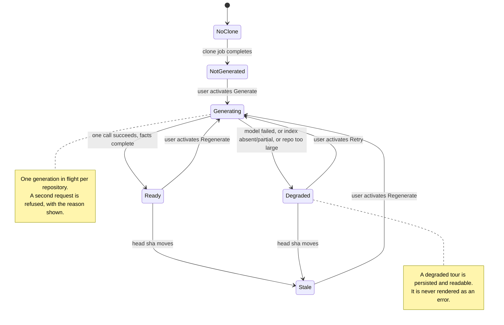
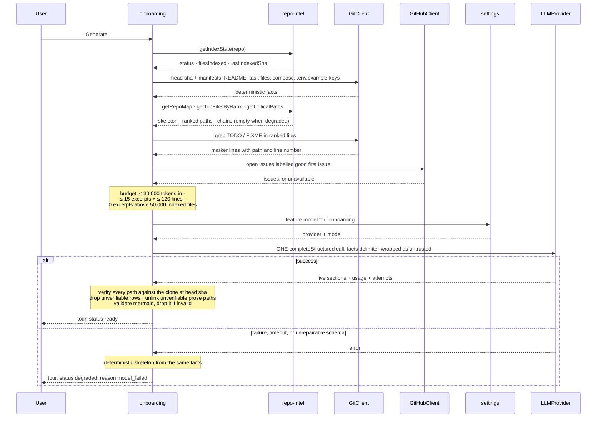
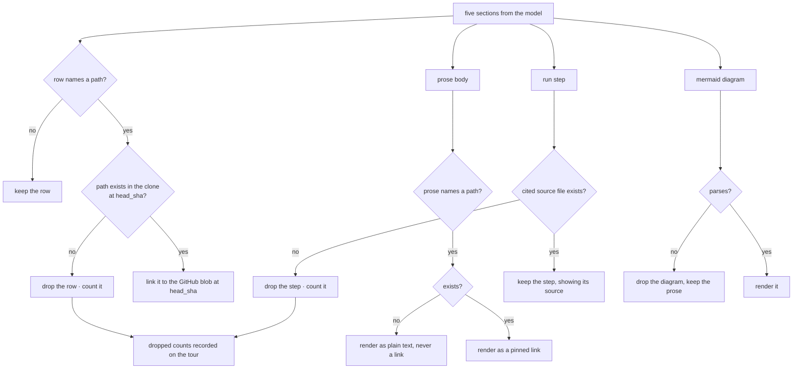

# Spec: Onboarding Tour

Spec ID: L06
Status: draft
Supersedes: none

## Problem and user

The user is a developer who has imported a repository they did not write - an open-source project, or a service owned by another team - and is now expected to judge pull requests in it.

DevDigest already puts a review in front of them.
It does not put the repository in front of them.
Reading `#482 Add rate limiting to public API endpoints` in `acme/payments-api` on day one, the user cannot tell whether `src/middleware/auth.ts` is load-bearing or vestigial, cannot tell where a request enters the system, cannot run the thing locally to check a claim, and cannot tell whether a finding that cites `src/lib/redis.ts` matters.
The reviewer is reviewing a diff against a codebase they have no model of, which is exactly the condition under which a plausible-sounding finding is indistinguishable from a correct one.

The workaround is to leave the product.
The user opens the repo in an editor, guesses the entry point from folder names, hunts for a run command in a README that may be stale, greps for the thing the PR touches, and rebuilds - badly, from scratch, per repository - the map that DevDigest already computed.

Because DevDigest already computed it.
`repo-intel` indexes every imported repository on clone: symbols, the import graph, a PageRank-derived file rank, and a cached repo map.
`getTopFilesByRank` and `getCriticalPaths` were written for this feature and named for it - `repo-intel/README.md` lists "Onboarding reading-path" as a downstream consumer - and nothing calls them.
The system prompt for this feature exists at `server/src/prompts/onboarding.system.md`, the `Onboarding` and `OnboardingSection` contracts exist in both copies of `contracts/knowledge.ts`, the `onboarding` table exists in the schema, the `onboarding` entry exists in `FEATURE_MODELS` with its own selectable provider and model, and the nav label "Onboarding Tour" exists in `client/messages/en/shell.json`.
There is no module, no route and no page.

L06 fills that seam: one page per imported repository that turns facts DevDigest already holds, plus one structured model call, into a five-part guided tour.

## Goals and non-goals

### Goals

1. A user who has never seen a repository can open one page and, in a single read, learn what the system is, which files carry the weight, how to run it, what to read first, and what to touch first.
2. Every claim in the tour is traceable: every path named exists in the clone at the commit the tour was generated at, every run step names the file it was taken from, and every first task cites a line or an issue.
3. The tour costs exactly one structured model call per generation, and the user can see the call count, the token counts and the dollar cost on the page rather than only in a log.
4. A repository whose index is incomplete, or whose model call fails, still produces a readable tour built from deterministic facts, labelled with what is missing.
5. The user knows when the tour has gone stale, by commit rather than by clock, and regenerates it when they choose to.

### Non-goals

- **Feeding the tour back into any prompt.**
  Tour text never enters a review, intent, conventions or any other LLM call.
  Model output grounding model output is how a plausible wrong claim becomes a "grounded" finding: a hallucinated sentence about the architecture, injected as context, would be cited by the reviewer as if it were repository fact and would survive every grounding gate the product has, because the gates check the diff and the clone, not the tour.
  Repository facts already reach the review prompt through the repo map, which is deterministic.
- **An in-product source-code viewer.**
  File links leave for GitHub.
  L05's document viewer is Markdown-only and restricted to four documentation roots; extending it into a general code browser is a feature of its own size.
- **Model-chosen sections.**
  The five sections are fixed in kind and order.
  A variable section set makes the page nav, the empty states and the tests unwritable.
- **Per-section regeneration.**
  The whole tour regenerates as one call, or not at all.
- **Writing the tour into the repository.**
  `contracts/platform.ts` carries a `sync_to_folder` setting whose UI copy promises that "onboarding tours and digests are written to the repo folder"; it is wired to nothing and stays that way.
  `server/clones/**` is do-not-touch, the `GitClient` port has no write method, and `sync()` fast-forwards over local changes - the same reasoning that removed document editing in L05.
- **Sharing a tour outside the product.**
  DevDigest is local-first, with no authentication, no public URLs and no sharing model.
  The mockup's "Share link" is cut; "Copy as Markdown" replaces it.
- **Git churn in the file ranking.**
  `pipeline/rank.ts` sets `hotness = 0` on purpose: the clone is shallow (`CLONE_DEPTH = 1`), so there is no churn window to measure, and `rank = pagerank`.
  The reading path is therefore ordered by PageRank-derived rank alone.
  Deepening every clone to recover churn is a repository-wide cost decision, out of scope here.
- **A sixth MCP tool.**
  The five shipped tools are untouched, on the same reasoning as L05: tool descriptions are taxed in every editor session, and this is a human-facing surface.
- **Localisation of the tour.**
  English only.
  The `{{language}}` placeholder in the starter prompt is filled with English and no language control ships.
- **Consuming L05's attachment set.**
  The tour reads its own fixed set of repository files.
  It never reads the documents a user attached to an agent or a skill, which keeps L05's non-goal 6 intact and keeps the two features' token budgets separate.
- **Automatic generation or automatic regeneration.**
  Nothing spends a model call without the user asking.

## User stories

- As a developer who just imported a repo I have never seen, I want one page that explains what it is, so my first review is not my first guess.
- As a developer, I want to know which four or five files actually matter here, so I can tell whether a finding about `src/lib/redis.ts` is worth reading.
- As a developer, I want the exact commands to run this locally, copyable, so I can check a claim instead of arguing about it.
- As a developer, I want to be told what to read first and why, so I stop opening files alphabetically.
- As a developer, I want a first task that points at a real `TODO` on a real line, not three invented chores.
- As a developer, I want every file name in the tour to open the real file on GitHub at the commit the tour describes.
- As a developer, I want to see that this cost one call and $0.004, because I am the one paying for it.
- As a developer, I want a repo whose index has not finished to still tell me something useful, and to tell me what it could not work out.
- As a developer, I want to know the tour is describing a commit from three weeks ago before I trust it.

## Module interactions

### Participants

| Module | Receives | Returns | On failure or unavailability |
| --- | --- | --- | --- |
| **onboarding** (new server module) | A repository id; a generate request | The stored tour, or the tour it just generated | Every failure path resolves to a persisted tour with `degraded` status and a stated reason - never a bare error page |
| **`repo-intel` facade** | `getIndexState`, `getRepoMap(repoId, tokenBudget)`, `getTopFilesByRank(repoId, n, { exclude })`, `getCriticalPaths(repoId)` | Index status and counts; the cached repo skeleton; ranked paths; dependency chains | Array-returning reads return `[]` when degraded, by the facade's own degraded contract; the two graph-dependent sections then fall back to the deterministic heuristic and are marked |
| **`GitClient` port** | The clone root, file reads at repo-relative paths, the current head sha | Manifests, README, task-runner files, compose files, `.env.example` key names, ranked-file excerpts | A read that fails drops that one fact; generation continues with the facts it has |
| **`GitHubClient` port** | Repository ref, the `good first issue` label | Open issues carrying that label | Absent, rate-limited or unauthenticated: the first-tasks section is built from `TODO`/`FIXME` markers alone and says so |
| **`modules/settings`** | Workspace id, feature id `onboarding` | The workspace's provider and model, else the registry default (`openrouter` / `deepseek/deepseek-v4-flash`) | The registry default is used |
| **`LLMProvider` port** | One structured request carrying the assembled facts and the section schema | `data`, `model`, `tokensIn`, `tokensOut`, `costUsd`, `attempts` | Failure, timeout or unrepairable output produces the deterministic skeleton |
| **`platform/jobs`** | A generation request | Job lifecycle for a unit of work longer than a request | A generation whose job dies is recorded as failed, and the page offers Retry |
| **`platform/prompt-log`** | Section name, source label, token count | Metadata-only log lines | No file content and no model output ever reach this path |
| **`project-context`** (L05) | Nothing | Nothing | Named only to fence the two features apart: L05 owns Markdown documents and the review prompt's `## Project context`; L06 owns the tour and reads its own inputs |
| **Client** | The stored tour and its provenance | The Onboarding Tour page, its five sections, its states and its cost record | Each state is enumerated under Design review and pinned by an acceptance criterion |

### Data crossing the boundaries

A **tour** - what the read returns and what the page renders from:

| Field | Meaning |
| --- | --- |
| `repo_id` | The repository the tour describes; one tour per repository |
| `status` | `ready` or `degraded` |
| `degraded_reasons` | Zero or more of `no_index`, `partial_index`, `repo_too_large`, `model_failed`, `issues_unavailable` |
| `head_sha` | The commit the clone stood at when facts were collected; every file link is pinned to it |
| `index_sha` | The commit `repo-intel` last indexed, which may lag `head_sha` |
| `files_indexed`, `files_skipped` | From the index state; what the header's file count means |
| `excerpts_used` | How many file excerpts reached the prompt; `0` on the facts-only path |
| `generated_at` | When the generation completed |
| `sections` | Exactly five, in fixed order |
| `usage` | `provider`, `model`, `tokens_in`, `tokens_out`, `cost_usd`, `attempts`, `duration_ms` |

A **section**:

| Field | Meaning |
| --- | --- |
| `kind` | One of `architecture`, `critical_paths`, `run_locally`, `reading_path`, `first_tasks` |
| `title` | The section's display title |
| `body` | Markdown prose; may be empty when `status` is not `ok` |
| `diagram` | Mermaid source, or absent; permitted only on `architecture` |
| `items` | The section's ordered rows, shaped per kind |
| `status` | `ok`, `empty`, or `no_graph` |

Row shapes, per kind:

| Kind | Row |
| --- | --- |
| `critical_paths` | `path`, `reason` (one line), `rank_percentile` |
| `run_locally` | `step` (ordinal), `command`, `source` - the repo-relative file the command was taken from |
| `reading_path` | `order`, `path`, `reason` (one line) |
| `first_tasks` | `title`, `origin` (`todo` or `issue`), and either `path` plus `line`, or `issue_number` |

`OnboardingSection` in both copies of `@devdigest/shared` carries `kind`, `title`, `body`, `diagram` and `links` today.
It gains `items` and `status`, and `Onboarding` gains the provenance and usage fields above.
The change lands in `server/src/vendor/shared` and `client/src/vendor/shared` in the same step, or the two sides drift.

`server/src/prompts/onboarding.system.md` currently instructs the model to write a `routes_and_apis` section and permits a diagram there.
`client/messages/en/onboarding.json` currently promises "overview, architecture, key modules, getting started, and conventions & gotchas".
Both describe a different five sections from the five this spec fixes, and both are updated by this feature; leaving either in place ships a page whose copy contradicts its content.

### Lifecycle

### Generation

### Verifying model output

### Layering constraints this feature must respect

- The tour is generated from `repo-intel` facade reads, never from the pipeline internals and never by re-indexing.
- Reading the clone happens through the `GitClient` port; no service reaches `node:fs` directly.
- `reviewer-core` is not involved in generating the tour and learns nothing about it; the only thing this feature borrows from it is the untrusted-delimiter helper used to wrap facts before they enter the prompt.
- The model call goes through the `LLMProvider` port with a provider and model resolved from `modules/settings`, never a hardcoded vendor client.
- Reads and generation are workspace-scoped like every other repository-scoped surface: a repository outside the caller's workspace is neither readable nor generatable.

## Acceptance criteria (EARS)

### Scope and placement

- **AC-1** The system shall hold at most one onboarding tour per imported repository.
  Observed at: the Onboarding Tour page, which shows the same tour on every visit until it is regenerated.
- **AC-2** The system shall offer the Onboarding Tour as a repository-scoped destination in the WORKSPACE navigation group, above Project Context.
  Observed at: the sidebar, for a workspace with an active repository.
- **AC-3** The system shall highlight exactly one navigation item for the Onboarding Tour page, and shall not highlight it on the add-repository screen.
  Observed at: the sidebar on the tour page and on the add-repository screen, which today both resolve to the `onboarding-tour` key.
- **AC-4** The system shall include no onboarding tour text in any review, intent or conventions prompt.
  Observed at: the run trace of a review on a repository that has a tour, whose prompt assembly lists no onboarding segment.

### Collecting the facts

- **AC-5** WHEN a generation starts, the system shall record the clone's current head commit as the tour's `head_sha`.
  Observed at: the tour's provenance header, which names the commit.
- **AC-6** The system shall collect the repository's declared stack, its runnable scripts, its container composition and its environment-variable names from the clone's manifests, task-runner files, compose files and `.env.example`.
  Observed at: the run-locally section, whose steps each cite one of those files.
- **AC-7** The system shall read environment-variable names from `.env.example` and shall read no value from any `.env` file.
  Observed at: the assembled prompt recorded for the generation, which contains variable names and no values.
- **AC-8** The system shall order candidate files by the repository's PageRank-derived file rank, and by no other ordering.
  Observed at: the reading path, whose order matches `getTopFilesByRank` for the same repository.
- **AC-9** The system shall select at most 15 files for excerpting and shall include at most the first 120 lines of each.
  Observed at: the recorded prompt-assembly metadata for the generation.
- **AC-10** IF the repository has more than 50,000 indexed files, THEN the system shall include no file excerpts in the generation and shall state that in the tour header.
  Observed at: the tour header, and `excerpts_used` reading `0`.
- **AC-11** IF the assembled facts exceed 30,000 tokens, THEN the system shall drop file excerpts first, then reduce the repo-map budget, until the assembled facts fit.
  Observed at: the recorded prompt-assembly metadata, whose total is at or below 30,000 tokens.

### The single model call

- **AC-12** WHEN the user activates Generate, the system shall make exactly one structured model call for that generation.
  Observed at: the generation's usage record, and the single structured-call log line for that generation.
- **AC-13** The system shall make at most two schema-repair reprompts for a generation, and shall record the resulting attempt count.
  Observed at: the tour's usage record, whose `attempts` never exceeds 3.
- **AC-14** The system shall resolve the provider and model for the generation from the workspace's `onboarding` feature-model setting, falling back to the registry default.
  Observed at: the tour's usage record, which names the model chosen in Settings.
- **AC-15** IF a generation does not complete within 90 seconds, THEN the system shall abandon it and record the tour as degraded with reason `model_failed`.
  Observed at: the tour header after a generation against an unresponsive provider.
- **AC-16** WHILE a generation for a repository is in flight, the system shall refuse a second generation for that repository and shall state that one is already running.
  Observed at: the disabled Generate control and its stated reason.

### The five sections

- **AC-17** The system shall render exactly five sections, in the order Architecture overview, Critical paths, How to run locally, Guided reading path, First tasks.
  Observed at: the page and its "ON THIS PAGE" navigation.
- **AC-18** The system shall render every one of the five sections on every tour, including the ones with no content.
  Observed at: the page for a repository with no runnable scripts, which still shows a How to run locally section.
- **AC-19** IF a section has no content, THEN the system shall render that section's own empty line naming what was looked for, rather than omitting the section.
  Observed at: the First tasks section of a repository with no markers and no labelled issues.
- **AC-20** The system shall render at most one diagram in the tour, on the Architecture overview section.
  Observed at: the page, where no other section carries a diagram.
- **AC-21** IF the model's diagram does not parse as Mermaid, THEN the system shall drop the diagram and keep the section's prose.
  Observed at: the Architecture overview section, which renders text and no empty diagram frame.
- **AC-22** The system shall list at most 8 critical paths, each with its file path and a single-line reason.
  Observed at: the Critical paths section.
- **AC-23** The system shall derive the critical-path candidates from the repository's dependency chains and file rank.
  Observed at: the Critical paths section, whose entries all appear in `getCriticalPaths` output for the same repository.
- **AC-24** The system shall list at most 12 run steps, each with an ordinal, a command, and the repo-relative file the command was taken from.
  Observed at: the How to run locally section, where each step names its source file.
- **AC-25** IF a run step cites a source file that does not exist in the clone at `head_sha`, THEN the system shall drop that step.
  Observed at: the How to run locally section, which contains no step citing a missing file.
- **AC-26** The system shall present each run step with a control that copies its command, operable from the keyboard, and shall confirm the copy visibly and to assistive technology.
  Observed at: the How to run locally section, driven from the keyboard alone.
- **AC-27** The system shall list at most 10 guided-reading entries, each with its position, its file path and a single-line reason.
  Observed at: the Guided reading path section.
- **AC-28** The system shall list at most 5 first tasks, each carrying either a repo-relative path with a line number, or an issue number.
  Observed at: the First tasks section.
- **AC-29** The system shall build first tasks only from `TODO` or `FIXME` markers found in the clone and from open issues carrying the `good first issue` label.
  Observed at: the First tasks section, where every entry resolves to a marker line or an issue.
- **AC-30** IF neither a marker nor a labelled issue is found, THEN the system shall render the First tasks section empty, naming both sources it looked in.
  Observed at: the First tasks section for a repository with neither.
- **AC-31** IF the issue source is unavailable, THEN the system shall build first tasks from markers alone and record the reason `issues_unavailable`.
  Observed at: the First tasks section's status line, on a repository with no GitHub token.

### Grounding what the model wrote

- **AC-32** The system shall verify every path emitted by the model against the clone at `head_sha` before persisting the tour.
  Observed at: the persisted tour, whose every path resolves in the clone at that commit.
- **AC-33** IF a row names a path that does not exist at `head_sha`, THEN the system shall drop that row and count the drop.
  Observed at: the persisted tour's dropped-row count, and the absence of the row on the page.
- **AC-34** IF section prose names a path that does not exist at `head_sha`, THEN the system shall render that path as plain text and not as a link.
  Observed at: the Architecture overview section for a generation that invented a path.
- **AC-35** The system shall link every verified path to that file on GitHub, pinned to `head_sha`.
  Observed at: the Open control on a critical-path row, whose target contains the tour's commit.
- **AC-36** The system shall provide no in-product source-code viewer for a file named by the tour.
  Observed at: every file link on the page, all of which leave for GitHub.

### The page and its states

- **AC-37** WHILE the repository has no clone on disk, the system shall render a prerequisite state naming the clone, and shall offer no generate control.
  Observed at: the Onboarding Tour page for a repository whose clone job has not finished.
- **AC-38** IF a repository has a clone and no tour, THEN the system shall render a generate call to action stating what will be produced.
  Observed at: the Onboarding Tour page for a freshly cloned repository.
- **AC-39** WHILE a generation is running, the system shall render the phase it is in and the five section headings it will fill.
  Observed at: the page during a generation.
- **AC-40** The system shall show, in the tour header, the number of indexed files the tour was generated from.
  Observed at: the header, reading "Generated from index of 12,450 files".
- **AC-41** The system shall show the tour's generation commit and generation time in the header.
  Observed at: the header, reading "generated at `abc1234`".
- **AC-42** The system shall render every section as an independently collapsible card, expanded by default.
  Observed at: the page, where collapsing Critical paths leaves the other four expanded.
- **AC-43** The system shall provide an on-page navigation that moves focus to each of the five sections.
  Observed at: the "ON THIS PAGE" list, operated from the keyboard.
- **AC-44** WHILE the viewport is narrower than 900 px, the system shall collapse the on-page navigation into a single jump control above the content.
  Observed at: the page at 480 px.
- **AC-45** The system shall provide a control that copies the whole tour as Markdown.
  Observed at: the header's Copy as Markdown control.
- **AC-46** The system shall offer no control that produces a shareable URL for a tour.
  Observed at: the header, which carries Regenerate and Copy as Markdown and nothing else.

### Freshness and regeneration

- **AC-47** IF the clone's head commit differs from the tour's `head_sha`, THEN the system shall mark the tour stale and state how many commits it is behind.
  Observed at: the header, reading "generated at `abc1234` · 14 commits behind".
- **AC-48** The system shall never regenerate a tour without the user activating a control.
  Observed at: the tour's `generated_at`, unchanged after a resync and an index refresh.
- **AC-49** WHEN the user activates Regenerate, the system shall replace the stored tour with the newly generated one.
  Observed at: the page after regeneration, which shows one tour with the new commit.
- **AC-50** The system shall keep the previous tour readable until a regeneration completes.
  Observed at: the page during a regeneration, which still renders the old sections.
- **AC-51** WHEN a repository is removed from the workspace, the system shall remove its tour.
  Observed at: the absence of the tour after the repository is re-imported.

### Cost and observability

- **AC-52** The system shall record the provider, model, input tokens, output tokens, cost and attempt count of each generation.
  Observed at: the tour's usage record.
- **AC-53** The system shall show the generation's call count, token counts and cost on the tour page.
  Observed at: the page's generation-cost line, reading "1 call · 24,110 in / 1,830 out · $0.0041".
- **AC-54** IF the provider returns no cost for a generation, THEN the system shall show the token counts and state that cost is unavailable, rather than showing zero.
  Observed at: the generation-cost line for a provider without pricing.
- **AC-55** The system shall emit one structured log line per generation carrying the section names, their token counts, the model and the correlation id, and no file content and no model output.
  Observed at: the server log for a generation.

### Degradation

- **AC-56** IF the repository's index is absent, partial or failed, THEN the system shall generate the tour from deterministic facts and shall record the corresponding degraded reason.
  Observed at: the tour header for a repository whose index job has not run.
- **AC-57** IF the import graph is unavailable, THEN the system shall build the Critical paths and Guided reading path sections from directory prominence and entry-point heuristics.
  Observed at: those two sections on an unindexed repository, which are populated.
- **AC-58** IF a section was built without the import graph, THEN the system shall mark that section as computed without the import graph.
  Observed at: the per-section marker on Critical paths and Guided reading path.
- **AC-59** IF a tour is degraded, THEN the system shall state each reason once in the header.
  Observed at: the header's status line.
- **AC-60** IF the model call fails, times out, or returns output that cannot be repaired into the section schema, THEN the system shall render the five section headings with the deterministic facts it collected, and shall offer a retry control.
  Observed at: the page after a generation against a provider with no credentials.
- **AC-61** The system shall persist a degraded tour with its status, so a reload renders the same content.
  Observed at: the page after a reload following a failed generation.
- **AC-62** WHEN a later generation succeeds, the system shall replace a degraded tour with the successful one.
  Observed at: the page after a retry that succeeds.
- **AC-63** The system shall render a tour page without an error state in every one of these cases.
  Observed at: the page, which shows content and a status line rather than an error, for a repository with no index, no issues access and a failed model call.

### Trust boundary

- **AC-64** The system shall wrap every fact taken from the repository or from GitHub in the engine's untrusted delimiter before it enters the generation prompt.
  Observed at: the recorded prompt for a generation, where the README, the excerpts and the issue titles are all enclosed.
- **AC-65** IF a fact contains the untrusted closing delimiter, THEN the system shall neutralise it so the block cannot be closed early.
  Observed at: the recorded prompt for a repository whose README contains `</untrusted>`.
- **AC-66** The system shall render tour prose without executing embedded HTML or script, and shall emit no link whose scheme is neither `http` nor `https`.
  Observed at: a section body containing a `<script>` tag and a `javascript:` link.
- **AC-67** The system shall accept no client-supplied file path as an input to generation or to any read this feature performs.
  Observed at: the feature's request schemas, which carry a repository id and nothing path-shaped.
- **AC-68** The system shall make no write to the repository clone.
  Observed at: `git status` inside the clone, unchanged after generating, regenerating and reading a tour.
- **AC-69** The system shall generate and read a tour only for a repository inside the caller's workspace.
  Observed at: the API response for a repository id belonging to another workspace.
- **AC-70** The system shall scrub secret-shaped strings from every log line this feature emits.
  Observed at: the server log for a generation over a repository whose README contains an example API key.

## Edge cases

| Case | Behaviour |
| --- | --- |
| Repository not yet cloned | Prerequisite state naming the clone; no Generate control; nothing persisted (AC-37) |
| Clone done, index not started | Generation proceeds from deterministic facts; both graph-dependent sections use the fallback and are marked (AC-56, AC-57, AC-58) |
| Index `partial` or `failed` | Same path as above, with the reason recorded separately from `no_index` |
| Repository over 50,000 indexed files | No excerpts; header says so; the other budgets are unchanged (AC-10) |
| Repository of three files | All five sections render; short lists are short, not padded; empty sections use their empty line (AC-19) |
| No package manifest and no task runner | How to run locally renders empty, naming the files it looked for |
| Monorepo with several run recipes | Steps still cite their source file, so two `pnpm dev` steps from different manifests are distinguishable |
| Model invents a path | Row dropped, prose path rendered unlinked, drop counted (AC-33, AC-34) |
| Model invents a run command with a plausible source | Step dropped when the cited source does not exist; a step whose source exists but whose command is wrong is not detectable here, and the cited source is what makes it checkable by the reader |
| Model returns four sections, or six | Repaired against the fixed schema; sections it omitted render as empty with their status; extra sections are discarded |
| Model returns unparseable output twice | Recorded as `model_failed`; deterministic skeleton persisted; Retry offered (AC-60, AC-61) |
| Provider has no credentials | Same as above; the header states the model call failed, not that the repository is unreadable |
| Provider returns no cost | Token counts shown, cost stated unavailable (AC-54) |
| Generation times out at 90 s | Degraded with `model_failed`; no partial tour is persisted from a half-finished stream (AC-15) |
| Second Generate while one runs | Refused with the reason shown; no second call is made (AC-16) |
| Two browser tabs open, one regenerates | The other tab shows the new tour on its next load; no locking beyond the in-flight rule |
| Head moves after generation | Tour marked stale with a commit distance; content unchanged until the user regenerates (AC-47, AC-48) |
| Resync or reindex completes | Tour untouched; staleness is computed from the sha, so it may become stale as a result |
| Repository removed | Tour removed with it (AC-51) |
| Repository has no GitHub token | Issues unavailable; first tasks come from markers; reason recorded (AC-31) |
| Repository has 400 `TODO` markers | At most 5 first tasks, chosen from the highest-ranked files; the cap is the point |
| `TODO` marker inside a vendored dependency | Excluded by the same junk-path filter the ranking already applies |
| Very long file path in a row | Filename kept whole, directory part middle-truncated, full path available on hover and to a screen reader |
| Multi-line run command | Copied whole, including its line breaks |
| Mermaid that parses but renders badly at the client | The client falls back to the section prose; no blank card and no thrown boundary |
| Section body containing raw HTML | Rendered as text, never executed (AC-66) |
| README containing prompt-injection text | Delimited as untrusted data; a tour whose content changes because a README asked it to is a defect, not a feature (AC-64) |
| Issue titled to look like an instruction | Same treatment; issue text is stranger-authored and is the least trusted input in the feature |

## Non-functional requirements

| Requirement | Number |
| --- | --- |
| Model calls per generation | Exactly 1, plus at most 2 schema-repair reprompts |
| Assembled prompt input ceiling | 30,000 tokens |
| File excerpts per generation | At most 15 files, at most 120 lines each |
| Excerpt cutoff by repository size | 0 excerpts above 50,000 indexed files |
| Generation wall-clock ceiling | 90,000 ms, after which the generation is recorded failed |
| Deterministic fact collection | Completes within 5,000 ms for a repository of 50,000 indexed files |
| Stored-tour read | Within 300 ms |
| Critical paths | At most 8 rows |
| Run steps | At most 12 steps |
| Guided reading path | At most 10 entries |
| First tasks | At most 5 entries |
| Concurrency | 1 generation in flight per repository |
| Cost visibility | Provider, model, tokens in, tokens out, cost and attempts shown on the page for every generation |
| File ranking | PageRank-derived rank only; `hotness` is 0 because `CLONE_DEPTH = 1` leaves no churn window |
| Viewport | Below 900 px the on-page navigation collapses to a jump control |
| Accessibility | Every copy control keyboard-operable with an announced confirmation; every section status conveyed by text as well as colour; the on-page navigation moves focus, not just scroll position |
| Storage | The tour, its provenance and its usage record are stored; no file body from the clone is stored |
| Localisation | English only; identifiers, paths, scripts, env-var names and route patterns are never translated |

## Inputs and provenance

| Input | Source | Absence means |
| --- | --- | --- |
| Head commit | The clone's working tree via `GitClient` | Generation cannot start; the page shows its prerequisite state |
| Index state, file counts, indexed sha | `repoIntel.getIndexState` | Treated as `no_index`; generation proceeds from deterministic facts |
| Repo skeleton | `repoIntel.getRepoMap` at a token budget | The architecture section is built from the file tree and manifests alone |
| Ranked file paths | `repoIntel.getTopFilesByRank` | The reading path falls back to directory prominence and entry-point heuristics, and is marked |
| Dependency chains | `repoIntel.getCriticalPaths` | The critical-paths section falls back the same way, and is marked |
| Manifests, task-runner files, compose files, README, `CONTRIBUTING` | The clone via `GitClient` | The corresponding facts are absent; sections that depended on them render empty with their status |
| Environment-variable names | `.env.example` in the clone | The run steps mention no variables; no `.env` is ever read |
| `TODO` / `FIXME` markers | The clone, within ranked, non-junk files | First tasks fall back to issues alone |
| `good first issue` issues | The GitHub client, for the repository under tour | First tasks fall back to markers alone, with `issues_unavailable` recorded |
| File excerpts | The clone, for rank-selected files | The generation runs facts-only, and the header says so |
| Provider and model | The workspace's `onboarding` feature-model setting | The registry default `openrouter` / `deepseek/deepseek-v4-flash` is used |
| Section text, diagram and rationales | One structured model call | The deterministic skeleton is rendered and the tour is degraded |
| Usage and cost | The structured result's `tokensIn`, `tokensOut`, `costUsd` and `attempts` | Cost is stated unavailable; token counts are always present |

## Untrusted inputs

Everything this feature reads was authored by someone other than the person reading the tour: the repository's own maintainers, a dependency vendored into the tree, or a stranger who opened an issue.
All of it is placed inside an LLM prompt next to the instructions that tell the model what to write, and the model's answer is then rendered as a page the user is meant to trust.
That makes this feature a full round trip across the trust boundary in both directions: untrusted text goes in, and the output that comes back is itself untrusted until it is checked against the clone.

| Untrusted input | Where the boundary is | What it may never cause |
| --- | --- | --- |
| README, `CONTRIBUTING`, manifests and task files | The untrusted delimiter wrapping every fact before assembly | They may never be read as instructions; the starter system prompt already states that delimited content is data, and this spec relies on that one guard rather than adding a second, weaker phrasing (AC-64) |
| File excerpts from ranked source files | The same wrapping step | A comment in a source file may never redirect what the tour says about the repository (AC-64) |
| GitHub issue titles and bodies | The same wrapping step | The least trusted input in the feature - anyone with a GitHub account can write one - and it may never change the tour beyond appearing as a first-task row (AC-64) |
| Any fact containing `</untrusted>` | The neutralising step inside the wrapper | It may never terminate its own block and escape into the instruction stream (AC-65) |
| `.env` values | Never read; only `.env.example` keys are | A secret may never enter a prompt, a tour, or a log (AC-7, AC-70) |
| Model output paths | Verification against the clone at `head_sha`, before persisting | An invented path may never be presented as a real one, and may never become a link (AC-32, AC-33, AC-34) |
| Model output run steps | The cited-source check | A command may never be presented without naming the file it came from, because that citation is the only thing the reader can check it against (AC-24, AC-25) |
| Model output prose | The client's Markdown renderer | It may never execute script in the user's browser, and may never produce a link whose scheme is not `http` or `https` (AC-66) |
| Model output diagram | Mermaid validation before persisting, and a render fallback at the client | An invalid or hostile diagram may never break the page or replace the section (AC-21) |
| Repository id from the client | The existing workspace-scoped context resolution | It may never let a caller generate or read a tour for a repository outside their workspace (AC-69) |
| Any path from the client | There is none - the feature accepts no path input | The path-traversal class of bug is removed by construction rather than defended against (AC-67) |
| Facts and output flowing to logs | `platform/prompt-log`, metadata-only, plus secret scrubbing | No file content and no model output may reach a log aggregator (AC-55, AC-70) |

## Design review

| Item | Mark | Note |
| --- | --- | --- |
| Never-generated state | accepted | It is the state every user meets first on every repository; the mockup starts at a finished tour. Generate call to action, using the copy already in `client/messages/en/onboarding.json` |
| Generating state | accepted | One structured call over a large repository is tens of seconds. Phase progress plus the five headings already visible |
| Failure state | accepted | The model call is the least reliable step in the chain; the mockup has no failure design. Deterministic skeleton, status line, Retry - never a bare error |
| Degraded-index state | accepted | Two of the five sections are graph-dependent and the graph may not exist. Per-section "computed without the import graph" marker plus one header status line |
| Stale state | accepted | "last refreshed 2h ago" cannot tell you whether the code moved. Replaced by "generated at `abc1234` · N commits behind" |
| "Open" had no destination | accepted | The product has no source viewer and L05's viewer is Markdown-only under four roots. Resolved as a GitHub blob permalink pinned to the generation sha, reusing `client/src/lib/github-urls.ts`, the same mechanism convention evidence already uses |
| "Share link" removed | accepted | No authentication, no public URLs, local-first. A link that works only on the author's laptop is a broken promise in a header. Replaced by Copy as Markdown |
| "12,450 files" defined | accepted | The only number DevDigest holds is `filesIndexed`; the header now says indexed files, and shows `filesSkipped` when it is non-zero |
| "First tasks" never rendered in the mockup | accepted | A fifth of the feature and the most hallucination-prone section. Grounded rows citing path and line or an issue number, with a real empty state |
| Empty behaviour for every section | accepted | A repository with no run scripts still has a How to run locally section; it says what it looked for. Sections are never dropped from the page nav |
| Copy feedback and keyboard access | accepted | Four copy targets in one card, none of them designed for the keyboard. Copy confirms visibly and to assistive technology |
| Long path truncation | accepted | `src/modules/repo-intel/pipeline/incremental.ts` already crowds the mockup's row width |
| Narrow viewport | accepted | "ON THIS PAGE" plus content does not fit below 900 px; the page nav collapses to a jump control |
| Mermaid render failure at the client | accepted | The model writes the diagram and the client renders it; failure falls back to prose rather than a blank card |
| Card collapse state | accepted | The chevrons in the mockup imply collapsible cards. Collapsible, all expanded by default, state not persisted |
| Model-emitted HTML in section bodies | accepted | Bodies come from a model that read attacker-influenceable files; rendered through the same sanitising path L05 uses |
| Model-emitted paths that do not exist | accepted | The starter prompt forbids inventing paths and nothing enforced it. Now verified against the clone before persisting |
| Cost and call count on the page | accepted | `StructuredResult` already returns tokens, cost and attempts. Putting them on the page makes "exactly one call" falsifiable without grepping a log, matching the L01 cost-badge precedent |
| Five sections fixed, and the starter's copy corrected | accepted | `client/messages/en/onboarding.json` promises a different five and `server/src/prompts/onboarding.system.md` asks for a `routes_and_apis` section. Both are updated by this feature; shipping either unchanged contradicts the page |
| Nav item under WORKSPACE above Project Context | accepted | Matches the mockup and the repo-scoped breadcrumb; it resolves against the active repository like Pull Requests and Project Context |
| The `/onboarding` nav collision | accepted | `activeKeyFor()` in `client/src/components/app-shell/helpers.ts` already returns `onboarding-tour` for the **add-repository** screen, so the sidebar will highlight the wrong item the moment this ships. AC-3 pins the requirement; which of the two surfaces is renamed is the planner's decision |
| Per-section regeneration | rejected | Multiplies calls and destroys the one-call property this lesson exists to demonstrate |
| Auto-generation on import | rejected | Spends money on every repository the user imports, including ones they never open |
| Auto-regeneration on drift | rejected | The user asked for explicit control; a tour that silently rewrites itself also silently re-bills |
| Model chooses its own sections | rejected | Unwritable page nav, unwritable empty states, untestable output |
| Tour text injected into review prompts | rejected | Model output grounding model output; a hallucinated architecture claim would be cited as repository fact and would pass every grounding gate the product has |
| Writing the tour into the repository folder | rejected | The `sync_to_folder` setting promises it, but `server/clones/**` is do-not-touch, `GitClient` has no write method, and `sync()` fast-forwards over local changes |
| An in-product source viewer | rejected | A feature of its own size; the permalink answers the same need today |
| The mockup's GLOBAL nav section, Eval Dashboard, Memory, Multi-Agent Review, Agent Performance, CI Runs | rejected | Not in `client/src/vendor/ui/nav.ts`; they belong to later lessons and are design-system furniture here |
| Git churn in the ranking | rejected | `pipeline/rank.ts` sets `hotness = 0` because `CLONE_DEPTH = 1` leaves no churn window; deepening every clone is a repository-wide cost decision |
| Sorting or filtering the critical-path and reading-path lists | open | Both are capped at 8 and 10 rows, where a sort control earns little. Revisit if the caps rise |
| A "start a review from this first task" action | open | The link between the tour and the review surface is currently the user's own navigation. The cost of not doing it is a page switch |
| Showing the assembled prompt for a generation, as the run trace does for reviews | open | Reviews have a trace drawer and this feature has none. The cost of not doing it is that a wrong tour is harder to debug than a wrong review |
| Per-section confidence or grounding markers, beyond the graph marker | open | Rows already carry citations; a confidence number would be the model's own, which the product has learned to distrust elsewhere |

## Open questions

1. **Is PageRank-only ranking good enough for the reading path?**
   The spec is written assuming it is, because `hotness` is structurally unavailable at `CLONE_DEPTH = 1`.
   The exposure is a repository where the highest-PageRank file is a stable utility module nobody touches, and the file a newcomer actually needs to read is the busy one.
   Deepening clones would answer it and costs disk and clone time on every import.
2. **Do the 30,000-token input ceiling and the 90-second wall clock hold on a real monorepo?**
   They were chosen, not measured.
   The first 200,000-file repository will show whether the facts-only path above 50,000 indexed files is the right cutoff or merely a plausible one.
3. **Should route and endpoint facts reach the architecture section?**
   The spec is written assuming they are optional and used where available.
   `repo-intel` exposes endpoints per changed file through `getBlastRadius`, not as a repository-wide read, so a route list means the facade gains a read - a decision for the plan, not a change to what this spec requires.
4. **Should a tour be regenerated automatically once drift passes some threshold?**
   The spec is written assuming never, because generation costs money and the user asked for explicit control.
   The exposure is a user who reads a tour that is 200 commits behind and does not look at the header.
5. **Should the assembled generation prompt be inspectable in the product?**
   The spec is written assuming not, so nothing but metadata is logged and nothing but the tour is stored.
   The exposure is that debugging a wrong tour means re-running it with logging turned up, where debugging a wrong review means opening its trace.
6. **What happens to the dead `sync_to_folder` setting?**
   The spec is written assuming it stays dead and unreferenced.
   Its UI copy promises this feature writes tours into the repository folder, which is now explicitly false, so the copy is wrong until someone either implements it or removes it.
7. **Should the tour be exposed to editor agents later?**
   The spec is written assuming no MCP tool ships in L06.
   If it later does, the tour becomes model-readable, and the "human-only" fence in the non-goals is the thing that would have to be re-argued.
