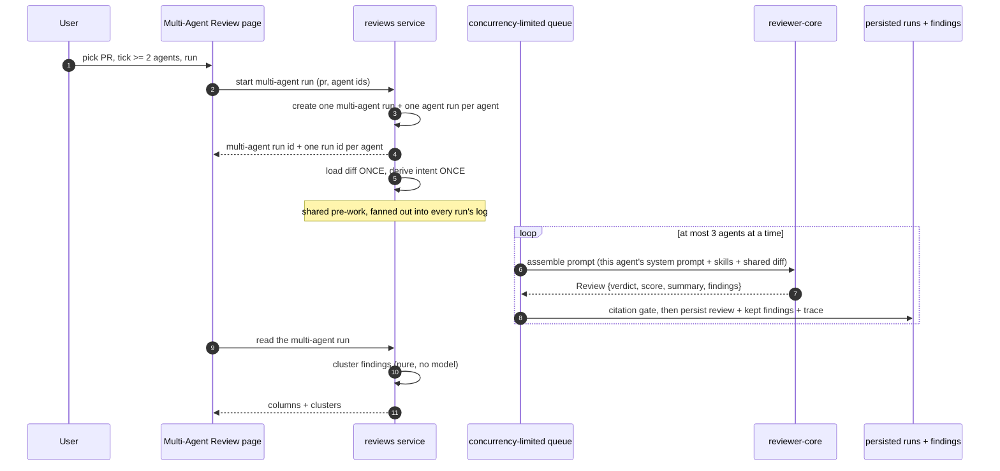
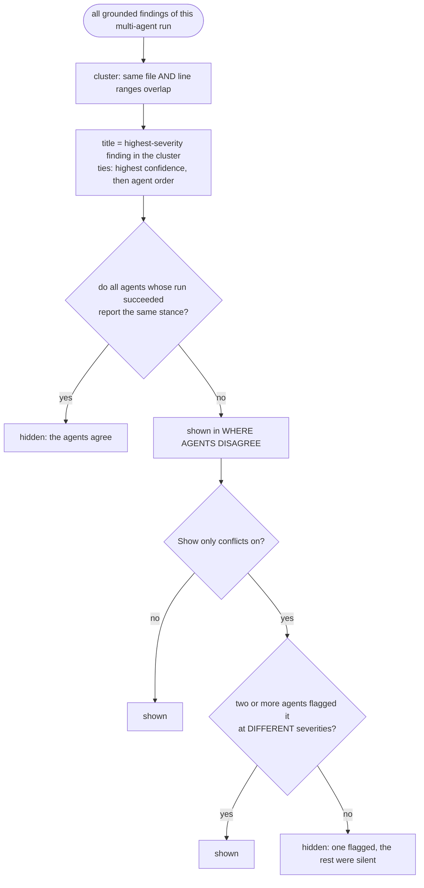

# Spec: Multi-Agent Review - fan one pull request out to several agents and compare them

Spec ID: L07
Status: draft
Supersedes: none

## Problem and user

The user owns several reviewer agents in DevDigest.
They have a Security agent, a Performance agent, a Junior Mentor, a Customer-Facing agent, an Architecture agent - each one a different system prompt, a different set of skills, a different idea of what matters in a diff.

Today they can only ask them one at a time.
`POST /pulls/:id/review` already accepts `all: true` and resolves every enabled agent, but the executor then walks the agents in a plain `for` loop, awaiting each one before starting the next (`server/src/modules/reviews/run-executor.ts:145`).
Five agents cost five review latencies end to end, and the answers land as five separate rows in the pull request's run history, interleaved with the commits, each one a separate click.

The comparison is the thing the user actually wants and the thing the product never gives them.
Two agents flagging the same line at different severities is a signal - it says the line is genuinely contested and deserves a human decision.
One agent flagging a line that four others walked past is a different signal, and it usually means either a real specialist catch or a false positive from a prompt that is too eager.
Both signals exist in the data already; both are invisible, because the findings are only ever shown one agent at a time.

The cost is that the user runs one agent, trusts it, and never learns where their agents disagree - which is exactly where their prompts need work.

## Goals and non-goals

### Goals

- Start one review of one pull request with two or more chosen agents, in parallel rather than one after another.
- Show every agent's verdict, score, cost, latency and findings on one screen, side by side.
- Name the places where the agents disagree, computed deterministically from the findings that already exist.
- Keep every agent's findings first-class: the same records, in the same pull request, with the same Accept, Dismiss and Turn into eval case actions as anywhere else in the product.
- Ship a deliberately simple implementation.
  The fan-out is N independent existing single-agent reviews over one shared input, plus one deterministic grouping pass over their findings.
  Nothing in this feature introduces a new model call, a new provider path, a new checkout mechanism, or agent-to-agent communication.

### Non-goals

- **No worktrees, no per-agent checkout.**
  Every selected agent reviews the same diff.
  `reviewer-core` is pure - no filesystem, no git, no database (`reviewer-core/.dependency-cruiser.cjs`, rule `core-has-no-io`) - so a worktree per agent would buy no isolation that matters and would break the package boundary to obtain it.
- **No reason for silence.**
  When an agent did not flag a cluster, the screen says "did not flag" and stops there.
  An agent that did not flag something wrote nothing about it, so the only way to produce a sentence explaining the silence is a second model pass per (agent x cluster).
  That is real cost, real latency, and a new prompt-injection surface, in exchange for a sentence the model invents after the fact.
- **No agent-to-agent communication.**
  No agent sees another agent's summary, findings or score, at any point, in any prompt.
  There is no debate round, no consensus pass, no arbiter model.
- **No new score.**
  The number on each agent's column is the run's existing score, computed from its findings by `scoreFromFindings` (`reviewer-core/src/review/reduce.ts:27`).
  There is no combined score, no "winning agent", no ranking of agents against each other.
- **No `Learn` action.**
  Persisting a finding into cross-session memory is a later lesson; the button is not shown.
- **No `Reply to author` action.**
  Posting a GitHub review comment from a finding is a later lesson; the button is not shown.
- **No `Memory`, `Agent Performance` or `CI Runs` navigation entries.**
  The mockup's sidebar shows them; they belong to later lessons and nothing in this spec creates them.
- **No semantic clustering.**
  Two findings are in the same cluster when they are on the same file and their line ranges overlap, and that is the whole of it - the same matching rule the eval harness already uses (`server/src/modules/eval/scoring.ts:64`).
- **No re-run of an individual agent inside a recorded multi-agent run.**
  A multi-agent run is a historical fact; running an agent again produces a new run.

## User stories

1. I pick a pull request and tick the agents I want, and one action runs all of them at once.
2. Before I press the button I see roughly what this will cost me and roughly how long it will take.
3. I read every agent's findings on one screen, either as columns beside each other or as tabs I flip between.
4. I see where my agents disagree - the same line, two different severities - without hunting for it.
5. I hide everything except the genuine contradictions, so I can look only at the lines two agents actually fought over.
6. I Accept or Dismiss a finding from this screen and it counts exactly as it would on the pull request page.
7. When one agent falls over, I still get the other four.

## Module interactions

### Vocabulary

| Term | Means |
| --- | --- |
| **agent run** | One agent's review of one pull request - an `agent_runs` row, its `reviews` row, its findings and its `run_traces` document. Unchanged by this feature. |
| **multi-agent run** | One user action that started two or more agent runs on the same pull request at the same time. A `multi_agent_runs` row (`server/src/db/schema/runs.ts:52`, present and unused today). |
| **cluster** | A set of findings from a multi-agent run that share a file and whose line ranges overlap. Computed on read, never stored. |
| **stance** | What one agent did about one cluster: a severity if it flagged something there, silence if it ran and did not, or no opinion if its run failed. |

### Participants

| Module | What this feature needs from it | What it returns | If it is unavailable or slow |
| --- | --- | --- | --- |
| `pulls` | The repository's pull requests for the picker (`GET /repos/:id/pulls`, `PrMeta`), and the chosen PR's identity and title for the results header. | `PrMeta` - `number`, `title`, `id`. | The picker cannot be populated; the configure screen shows the pull-request step as unavailable and the run control stays disabled. |
| `agents` | The workspace's enabled agents, with `name` and the agent's own `description` (`server/src/db/schema/agents.ts`). | Agent rows. | The agent step shows nothing selectable and the run control stays disabled. |
| `reviews` | The whole execution path: `resolveTargets`, `runReview`, `executeRuns`, the citation gate, run persistence, run traces, the SSE run stream, and the finding actions (`server/src/modules/reviews/`). | One `agent_runs` row per agent, each with `score`, `duration_ms`, `cost_usd`, `findings_count`, `blockers`, `status`, `error`; the persisted `reviews` row with its `summary` and `verdict`; the kept findings. | A failure inside one agent run fails that run only; the multi-agent run continues (AC-22). Failure of the shared pre-work (diff load) fails every queued run, which the executor already does (`failAll`). |
| `reviewer-core` | The review itself, and `scoreFromFindings` for the displayed score. Nothing in this feature adds to it. | A `Review` - `{ verdict, score, summary, findings }`. | Not separately reachable: it is in-process, pure, and fails only as part of the agent run that called it. |
| `eval` | The finding-to-eval-case action already available on a finding card, reused unchanged. | An eval case. | The Turn into eval case control reports its own failure; nothing else on the screen is affected. |

### What crosses the boundary

The read shape for the results screen is already declared in `@devdigest/shared` and unused today: `MultiAgentRun`, `AgentColumn`, `AgentColumnFinding`, `Conflict` and `ConflictTake` in `contracts/observability.ts`, byte-identical in both physical copies and exported from both barrels.
The plan decides whether to adopt them; this spec fixes what the shape must carry:

- Per multi-agent run: its identity, the pull request, when it ran, how many agents took part, the total duration (AC-24), the total cost (AC-25).
- Per agent column: the agent's identity and name, its run's identity, its status, its verdict, its score, its summary, its duration, its cost, and its findings with severity, title, file and start line.
- Per cluster row: the file, the display line, the cluster title, and one stance per agent in the run.
- Per stance: the agent, and either a severity plus the rationale of the finding it is standing on, or the fact that the agent was silent, or the fact that the agent's run failed.
  A silent stance carries no prose (AC-35).

One structural fact the shape depends on and the database does not yet have: `agent_runs` carries no reference to `multi_agent_runs`.
The link this spec's criteria need is single-valued in one direction - an agent run belongs to at most one multi-agent run, and a multi-agent run enumerates its agent runs.
Nothing here wants one agent run to appear in two multi-agent runs, so a many-to-many link would be wider than the requirement.

### The fan-out

The two facts the diagram is drawn to make hard to miss: no arrow ever runs from one agent's output back into another agent's prompt, and the clustering step touches no model.

### What the disagreement section shows

### Where the runs surface outside this feature

Each agent's run is an ordinary agent run carrying the pull request's `pr_id`.
That is deliberate and it has consequences the pull-request page must absorb rather than be surprised by: the findings appear in that pull request's normal findings list, Accept and Dismiss write the same records they always did, and the run history gains N rows at one timestamp.
AC-27 to AC-29 state what the pull request page must do so four runs arriving at once read as one action.

## Acceptance criteria (EARS)

### Getting to the screen

**AC-1**
The system shall offer a Multi-Agent Review destination in the WORKSPACE navigation group, scoped to the active repository.
Observed at: the sidebar, and the navigation key the shell derives for the page.

**AC-2**
WHEN the Multi-Agent Review page is open, the system shall highlight exactly one navigation item.
Observed at: the derived active navigation key for the page path.

### Configuring a run

**AC-3**
WHILE no pull request is chosen, the system shall replace the agent step with a message telling the user to choose a pull request first.
Observed at: the configure screen's step 2.

**AC-4**
WHILE no pull request is chosen, the system shall keep the run control disabled.
Observed at: the run control's disabled state.

**AC-5**
WHEN a pull request is chosen, the system shall list every enabled agent in the workspace as a selectable row.
Observed at: the configure screen's step 2, compared against the enabled agents.

**AC-6**
The system shall show on each agent row the agent's icon, its name, and its stored description, and no run duration, no cost, and no verdict sentence.
Observed at: an agent row on the configure screen.

**AC-7**
The system shall label the run control with the number of agents currently selected.
Observed at: the run control's label, which reads `(0)` when nothing is selected.

**AC-8**
WHILE fewer than two agents are selected, the system shall keep the run control disabled.
Observed at: the run control's disabled state with one agent ticked.

**AC-9**
The system shall place no upper limit on the number of agents that can be selected.
Observed at: selecting every listed agent leaves the run control enabled.

**AC-10**
WHEN the select-all control is used, the system shall select every listed agent.
Observed at: the checkbox state of every agent row.

### The estimate

**AC-11**
WHERE at least one selected agent has a completed successful run, the system shall show beside the run control an estimated duration equal to the largest of the selected agents' median run durations, taken over each agent's last ten successful runs.
Observed at: the estimate text beside the run control.

**AC-12**
WHERE at least one selected agent has a completed successful run, the system shall show beside the run control an estimated cost equal to the sum of the selected agents' median run costs, taken over each agent's last ten successful runs.
Observed at: the estimate text beside the run control.

**AC-13**
IF a selected agent has no successful run, THEN the system shall leave that agent out of both estimates and mark the estimate as partial.
Observed at: the estimate text, with one never-run agent selected alongside one that has history.

**AC-14**
IF no selected agent has a successful run, THEN the system shall show no estimate at all.
Observed at: the area beside the run control, which is empty.

**AC-15**
The system shall compute the estimate from recorded run history only, without any model call and without starting a run.
Observed at: no new `agent_runs` row and no provider request between opening the page and pressing the run control.

### Executing

**AC-16**
WHEN the run control is used, the system shall start exactly one agent run per selected agent against the chosen pull request.
Observed at: the pull request's run rows created by that action.

**AC-17**
The system shall execute at most three of a multi-agent run's agent runs at the same time.
Observed at: the recorded start times of the agent runs of a run with five agents.

**AC-18**
The system shall load the pull request's diff once per multi-agent run and give the same diff to every agent in it.
Observed at: the diff block of each agent run's persisted prompt assembly.

**AC-19**
The system shall derive the pull request's intent once per multi-agent run and give the same derived intent to every agent in it.
Observed at: the intent block of each agent run's persisted prompt assembly.

**AC-20**
The system shall not place any agent's findings, summary, score or verdict into any other agent's prompt.
Observed at: each agent run's persisted prompt assembly, which contains no other agent's name or output.

**AC-21**
The system shall record each agent's work as an ordinary agent run carrying the chosen pull request's identity, with the same status, duration, cost, findings count, score and blocker fields a single-agent review records.
Observed at: the agent run rows, compared field by field against a run started from the pull request page.

**AC-22**
IF at least one agent run of a multi-agent run fails and at least one succeeds, THEN the system shall complete the multi-agent run and present the successful agents' results.
Observed at: the results screen after forcing one agent's provider call to fail.

**AC-23**
IF every agent run of a multi-agent run fails, THEN the system shall present the multi-agent run as failed and show each agent's recorded error.
Observed at: the results screen after forcing every provider call to fail.

**AC-24**
The system shall report a multi-agent run's duration as the largest of its agent runs' durations.
Observed at: the results header, compared against the agent runs' recorded durations.

**AC-25**
The system shall report a multi-agent run's cost as the sum of its agent runs' costs.
Observed at: the results header, compared against the agent runs' recorded costs.

**AC-26**
IF an agent run's cost is unknown, THEN the system shall leave it out of the total and mark the total as partial.
Observed at: the results header for a run whose agent recorded a null cost.

### On the pull request page

**AC-27**
The system shall present the agent runs of one multi-agent run in the pull request's run history as one group, labelled with the number of agents and the time the multi-agent run started.
Observed at: the pull request's run history after a four-agent run.

**AC-28**
WHEN that group is opened, the system shall navigate to that multi-agent run's results.
Observed at: the destination of the group's control.

**AC-29**
The system shall include every agent run's findings in the pull request's findings list, each attributed to the agent that produced it.
Observed at: the pull request's findings list after a multi-agent run.

### Reading the results

**AC-30**
The system shall present the results in a columns view and a tabs view, with one control to switch between them.
Observed at: the results header's view toggle.

**AC-31**
WHEN the user switches view, the system shall use that view again the next time the results screen is opened in the same browser.
Observed at: the view shown after a page reload.

**AC-32**
The system shall show, in the results header, the number of agents in the run, that they ran in parallel, the run's duration, and the run's cost.
Observed at: the results header line.

**AC-33**
The system shall show for each agent its name, its run's duration, its run's cost, its score, its findings with severity, title, file and start line, its findings count, and a control that opens that run's trace.
Observed at: an agent's column in the columns view, and an agent's tab in the tabs view.

**AC-34**
The system shall show as an agent's score the score recorded on its agent run, which is derived from that run's findings.
Observed at: the score on an agent's column, compared against the run's recorded score.

**AC-35**
The system shall show as an agent's one-line verdict the summary of that agent's persisted review, unmodified.
Observed at: the summary line in the tabs view, compared against the persisted review's summary.

**AC-36**
The system shall issue no model call while rendering a multi-agent run's results.
Observed at: no provider request between opening the results screen and it finishing rendering.

**AC-37**
The system shall offer on each finding in the tabs view exactly the Accept, Dismiss and Turn into eval case actions.
Observed at: the action row of an expanded finding card.

**AC-38**
WHEN a finding is accepted or dismissed from this screen, the system shall record the same action the pull request page records, and the pull request page shall show that finding as acted on.
Observed at: the finding's accepted or dismissed timestamp, and the pull request's findings list.

**AC-39**
IF an agent run failed, THEN the system shall show its recorded error in that agent's column and tab, in place of a score and a findings list.
Observed at: the failed agent's column.

**AC-40**
WHILE an agent run is still running, the system shall show that agent as running rather than as having produced no findings.
Observed at: that agent's column during a run.

### Where agents disagree

**AC-41**
The system shall group a multi-agent run's grounded findings into clusters, placing two findings in the same cluster when their file strings are equal and their line ranges share at least one line.
Observed at: the cluster membership of two findings on the same file at lines 28-30 and 29-31.

**AC-42**
The system shall compute the clusters without any model call.
Observed at: no provider request during the read that produces the disagreement section.

**AC-43**
The system shall title a cluster with the title of its highest-severity finding, breaking a tie by highest confidence and then by the order of the agents in the run.
Observed at: the cluster heading for a cluster holding one CRITICAL and one SUGGESTION finding.

**AC-44**
The system shall label a cluster with the file and the start line of the finding that supplied its title.
Observed at: the cluster heading's `file:line` label.

**AC-45**
The system shall give the disagreement section one column for every agent in the multi-agent run, in every cluster row, including agents that produced no findings at all and agents whose run failed.
Observed at: the column headings of a cluster row, compared against the agents selected for the run.

**AC-46**
The system shall show a cluster only when the agents whose runs succeeded do not all report the same stance on it.
Observed at: a cluster that every successful agent flagged as WARNING, which is absent from the section.

**AC-47**
WHILE the show-only-conflicts control is on, the system shall show only clusters on which two or more agents reported findings of different severities.
Observed at: a cluster flagged by one agent and by nobody else, which is absent while the control is on and present while it is off.

**AC-48**
The system shall show for an agent that ran successfully and reported no finding in a cluster the words "did not flag" and no further text.
Observed at: that agent's cell in the cluster row.

**AC-49**
IF an agent's run failed, THEN the system shall show that agent's cell in every cluster as having no opinion, distinguishable from "did not flag".
Observed at: the failed agent's cell in a cluster row.

**AC-50**
The system shall show for an agent that flagged a cluster the severity of its finding there and that finding's own rationale, truncated to one line.
Observed at: that agent's cell in the cluster row, compared against the persisted finding's rationale.

**AC-51**
IF an agent produced more than one finding in a cluster, THEN the system shall show its highest-severity finding in that cell.
Observed at: the cell for an agent with a WARNING and a SUGGESTION in the same cluster.

**AC-52**
IF no cluster of a multi-agent run diverges, THEN the system shall state that the agents agreed instead of rendering an empty table.
Observed at: the disagreement section of a run where every agent produced identical findings.

### Untrusted input

**AC-53**
The system shall wrap the diff, the pull request title and body, and any project-context document in the existing untrusted delimiters and prepend the existing injection guard, identically to a single-agent review.
Observed at: each agent run's persisted prompt assembly.

**AC-54**
The system shall drop any finding whose location does not intersect the diff before it reaches an agent column or a cluster.
Observed at: the run's grounding summary and the absence of the dropped finding from the results screen.

**AC-55**
IF the diff, the pull request body or a project document contains text instructing the reviewer to ignore an issue, THEN the system shall still present any finding the agent produced, without that text changing which agents ran or which findings are shown.
Observed at: the results screen for a pull request whose body asks reviewers to skip the file.

### Returning to a run

These criteria were added after the mockups were reviewed.
The four mockups showed only "configure" and "results", so nothing in them answered what a user sees when they open Multi-Agent Review a second time.
As originally written, the answer was "the configure screen, always", which left a completed run reachable only from the pull request page.

**AC-56**
WHEN the Multi-Agent Review page is opened and the repository has at least one multi-agent run, the system shall list that repository's multi-agent runs, most recent first.
Observed at: the Multi-Agent Review page after one run has completed.

**AC-57**
The system shall show on each listed run its pull request number and title, the number of agents, when it started, its status, its findings total, and its duration and cost with the partial marker.
Observed at: a row in the recent-runs list.

**AC-58**
WHEN a listed run is activated, the system shall open that run's results.
Observed at: the destination reached from a row.

**AC-59**
The system shall offer on that page a control that starts a new multi-agent review, whether or not any past run exists.
Observed at: the page with no runs, and the page with several.

**AC-60**
IF the repository has no multi-agent run, THEN the system shall say so and offer only the control that starts one.
Observed at: the page for a repository that has never had a multi-agent review.

**AC-61**
The system shall not include any finding in the response that populates the recent-runs list.
Observed at: the payload of the list request.

## Edge cases

| Case | Behaviour |
| --- | --- |
| The repository has no pull requests | The pull-request picker is empty and says so; the run control stays disabled (AC-4). |
| The workspace has fewer than two enabled agents | The agent list shows what exists and the run control stays disabled (AC-8), with the reason stated next to it. |
| Exactly two agents selected | Runs normally; two columns, and any cluster where one flagged and the other did not is a divergence but not a conflict (AC-46, AC-47). |
| Ten agents selected | Runs three at a time (AC-17). The columns view scrolls horizontally rather than shrinking columns below readability; the tabs view scrolls its tab strip. |
| Every agent produced zero findings | Every column shows a score of 100 and no findings; the disagreement section says the agents agreed (AC-52). |
| One agent produced 200 findings | Its column scrolls within its own bounds; the other columns keep their height. Cluster rows are paginated by the same list behaviour, not by dropping rows. |
| A 200-character finding title | Truncated in the column and in the cluster heading, shown in full on the expanded finding card. |
| An unbroken 500-character token in a rationale | The cell scrolls or wraps within its width; it never widens the cluster row. |
| A finding whose start line exceeds its end line | The range is read as the interval between the two numbers in either order, so clustering is unaffected - the same normalisation the eval scorer applies. |
| Two findings on the same line in different files | Different clusters: file equality is required first (AC-41). |
| The user leaves the results screen mid-run | The runs continue; returning to the screen shows their current state, because every run's state is persisted, not held in the page. |
| The user starts a second multi-agent run on the same pull request while one is in flight | Refused, with the in-flight run named. One multi-agent run per pull request at a time. |
| The user reloads during a run | The screen restores from the persisted runs, with running agents shown as running (AC-40). |
| An agent is deleted between the run and reading it | The column keeps the run's recorded agent name; the run row's agent reference is already nullable. |
| An agent's provider key is missing | That agent's run fails with the provider error and the rest continue (AC-22). |
| Every provider key is missing | Every run fails and the multi-agent run is failed (AC-23). |
| The diff cannot be loaded | Every queued run fails with the diff error - the existing shared pre-work behaviour - and the multi-agent run is failed (AC-23). |
| A cluster where one agent flagged CRITICAL and another flagged CRITICAL and a third was silent | Shown as a divergence, hidden by the conflicts filter, because no two agents differ on severity (AC-47). |
| Keyboard-only user | Every agent checkbox, the select-all control, the view toggle, the conflicts toggle, each trace control and each finding action is reachable by tab; the trace drawer traps focus and returns it to the control that opened it. |
| Narrow viewport | The columns view falls back to the tabs view rather than compressing four columns; the cluster rows stack one agent per line with the agent name as the label. |
| Offline | The configure screen keeps the last loaded agent list and disables the run control with the connection stated; the results screen shows the last loaded run and says it is stale. |

## Non-functional requirements

- **A multi-agent run adds zero model calls beyond the agent runs themselves.**
  N agents means exactly N reviews, plus the one shared intent classification the single-agent path already makes.
  Clustering, the conflict filter, the scores, the summaries and the estimate are all pure code over data that already exists.
- **Concurrency is 3.**
  The same default the repository's existing queue runs at (`server/src/platform/jobs.ts:42`).
  A ten-agent run therefore costs about four review latencies, not ten.
- **A multi-agent run never goes through the background job runner.**
  That runner re-runs a whole handler up to two times by default, and a retry after a successful model call would re-issue and re-bill every call the first attempt made - the same reason the eval pipeline stays off it.
- **At most 4 multi-agent run starts per minute per workspace.**
  One request fans out into N billable model calls, so this matches the tightest existing limit on this API rather than the 10 per minute on the single-PR review route.
- **At most one multi-agent run in flight per pull request.**
- **Clustering is under 10 ms for a run of 10 agents with 20 findings each.**
  It is at most 200 x 200 file-and-range comparisons, with no I/O.
- **The results screen loads in one request.**
  Columns and clusters come from the same read; the screen never issues one request per agent.
- **The estimate reads at most the last ten successful runs per selected agent.**
- **Accessibility: every severity is carried by text as well as colour.**
  The columns are colour-coded per agent in the mockup; colour is decoration, and an agent's identity, a finding's severity and a stance of "did not flag" are all readable without it.

## Inputs and provenance

| Input | Source | Absence means |
| --- | --- | --- |
| The chosen pull request | The repository's imported pull requests (`GET /repos/:id/pulls`) | No run can start (AC-4). A multi-agent run cannot exist without a pull request, which is why this screen is repository-scoped. |
| The set of chosen agents | The user's ticks over the workspace's enabled agents | Fewer than two means no run (AC-8). |
| Each agent's system prompt, skills, model, provider, repo-intel toggle and project-context selection | The agent record, unchanged by this feature | An agent missing a provider key fails its own run only (AC-22). |
| The diff | Loaded once per multi-agent run by the existing diff loader | Every queued run fails (AC-23). |
| The derived intent | The existing single classification per review request | Best-effort in the existing path; its absence degrades the prompt, never fails the run. |
| Each agent's findings, score, summary, verdict, duration and cost | The agent run the fan-out created | A failed run contributes none of them and shows its error instead (AC-39). |
| The duration and cost estimate | The median of each selected agent's last ten successful agent runs | No history means no estimate (AC-14); partial history means a partial estimate (AC-13). |
| The columns/tabs preference | The browser's local storage | Absent on a fresh browser; the columns view is the default. |
| The clusters | Computed on read from the run's grounded findings | Cannot be absent while findings exist; no findings means the section says the agents agreed (AC-52). |

## Untrusted inputs

Multi-agent review introduces **no new trust boundary**.
Every untrusted input it handles is one the single-agent path already handles, through the same code, with the same protections.

| Untrusted input | Where it comes from | What it may never be allowed to do |
| --- | --- | --- |
| The unified diff | The imported repository, authored by whoever wrote the pull request | Instruct the reviewer. It is wrapped in `<untrusted source="...">` delimiters, its own closing delimiter is escaped, and the shared injection guard states that delimited content is data (`reviewer-core/src/prompt.ts:16`). |
| The pull request title and body | The pull request author | Redefine the agent's job, waive a severity, or descope the review. The guard names this attack explicitly, in any language, and the body is capped at 4,000 characters. |
| File contents and code comments reaching the prompt through repo intel or project context | Third-party repository files | Same as the diff: delimited data, never instructions. |
| Every agent's model output | The provider | Reach the screen ungrounded. Any finding whose location does not intersect the diff is dropped by the citation gate before it can become a column entry or a cluster (AC-54). |
| Every agent's model output | The provider | Reach another agent. No agent's output enters any other agent's prompt (AC-20). This is the property that keeps the fan-out simple: N independent reviews cannot compound an injection, because nothing carries one agent's compromised output into the next agent's context. |
| A finding's `file` string | The model | Be used to open a file. It is compared as a string when clustering and rendered as a label; a path such as `../../etc/passwd` is a string that clusters with nothing. |
| A finding's title and rationale, rendered in a column and a cluster cell | The model | Execute. They render as text and markdown through the existing finding renderers, not as HTML. |

The one design decision here that is a security decision as much as a cost decision is the rejection of a reason for silence.
Generating "Not a security concern." for each (agent x cluster) pair would mean a second model pass whose input is the other agents' findings - and that is the one thing this design refuses to do, because it turns N independent reviews into a graph where one agent's output reaches another agent's prompt.

## Design review

| Line | State | Detail |
| --- | --- | --- |
| The header reads "fan-out via worktrees" | **rejected** | No worktrees. Every agent reviews the same diff and the same repository state, and differs only in its system prompt, its skills and its own per-agent toggles. `reviewer-core` is pure and touches no filesystem, so a checkout per agent isolates nothing that matters and would break `core-has-no-io` to obtain it. The header reads "N agents · parallel · <duration>s · $<cost>" (AC-32). |
| Each "did not flag" cell carries an explanatory sentence ("Not a security concern.", "Cosmetic; out of scope for arch review.") | **rejected** | An agent that did not flag something wrote nothing about it. The only way to produce that sentence is a second model pass per (agent x cluster): real cost, real latency, a new injection surface, and a rationalisation the model invents after the fact. The cell reads "did not flag" and nothing else (AC-48). |
| The disagreement table shows an Architecture column although Architecture was not selected | **rejected** | A mockup error. The table's columns are exactly the agents in this run, all of them, in every row (AC-45). |
| Multi-Agent Review sits in a GLOBAL navigation group | **rejected** | It contradicts the same mockup's repository-scoped breadcrumb (`#482`) and its repository switcher. A run cannot exist without a pull request, and a pull request belongs to a repository, so the page is repository-scoped and the entry belongs in WORKSPACE (AC-1). |
| Agent rows on the configure screen show a verdict sentence and `8.2s · $0.06` | **rejected** | Leakage from the results screen. Before a run those numbers do not exist for this pull request. The rows show icon, name and the agent's own description (AC-6). |
| The mockups never show what the page looks like on a return visit | **open, now decided** | Both mockups of this page are first-visit states: one configures a run, one shows a run's results. Neither answers what the sidebar entry leads to once a run exists. Decided against the mockups: the page lists the repository's runs and offers a control to start another (AC-56 to AC-61). A silent redirect to the newest run was rejected - it hides that older runs exist and leaves no way to start a new one. |
| The estimate `≈ 8.2s · $0.20` beside the run button | **accepted** | Kept, as the only pre-run number on the screen, computed from run history rather than invented (AC-11, AC-12). |
| The empty state shows "Run multi-agent review (4)" with nothing selected | **rejected** | A mockup error. The counter reflects the real selection and reads `(0)` (AC-7), and the control is disabled (AC-4, AC-8). |
| `Learn` and `Reply to author` on finding cards | **rejected** | Later lessons. Only Accept, Dismiss and Turn into eval case are shown (AC-37). |
| No loading state is shown for a run in progress | **accepted** | The mockups only show a finished run. Running agents are shown as running (AC-40); the results screen is reachable while the run is in flight. |
| No failure state is shown for an agent | **accepted** | Covered by AC-22, AC-23, AC-39 and AC-49, including the distinction between a silent agent and an agent with no opinion. |
| No empty state is shown for the disagreement section | **accepted** | Covered by AC-52. |
| No state is shown for a run where every agent found nothing | **accepted** | Covered in Edge cases; the columns show a score of 100 and no findings. |
| No narrow-viewport or keyboard behaviour is shown | **accepted** | Covered in Edge cases: the columns view falls back to tabs, cluster rows stack, and every control is tab-reachable. |
| The mockup shows exactly two cluster rows and never a long one | **accepted** | Long clusters, long titles and long rationales are covered in Edge cases. |
| The columns are colour-coded per agent, and severity is carried by an icon | **open** | Colour alone must not be the only carrier of an agent's identity or a finding's severity. Cost of not doing it: the screen is unreadable to a colour-blind user precisely where it is most information-dense. |
| A cluster cell could link to the finding it stands on | **open** | The mockup's cells are inert. Making the severity chip jump to that agent's tab and expand that finding would close the loop between "they disagree" and "let me decide". Cost of not doing it: the user reads a disagreement and then has to find the finding by hand. |
| The results screen could offer a per-agent re-run | **open** | Out of scope here (see Non-goals). Cost of not doing it: fixing one agent's prompt and re-comparing means starting a whole new multi-agent run. |

## Open questions

1. **The existing `ConflictTake` contract carries a `note: string` field that a silent stance has nothing to put in.**
   `contracts/observability.ts` declares `verdict: Severity | 'ignored'` alongside a required `note`, which is exactly the explanatory sentence AC-48 rejects.
   The spec is written on the assumption that a silent stance carries no prose, and that whichever shape the plan adopts must make that representable - either by leaving the existing field empty for a silent stance or by narrowing it.
   Nothing else in the codebase reads these contracts today, so no consumer breaks either way.

2. **`Conflict` declares a single `line`, while clustering works on ranges.**
   The spec assumes the single line shown is the start line of the finding that supplied the cluster title (AC-44), and that the range is used for matching only.

3. **The navigation registry lives in a do-not-touch path.**
   `NAV` is defined in `client/src/vendor/ui/nav.ts`, and `client/src/vendor/ui/**` is listed as a vendored kit not to be edited - yet L02, L05 and L06 each added their entry there.
   The spec assumes AC-1 is satisfied the same way those lessons satisfied it, and that the shell already derives the key `multi-agent` for this page (`client/src/components/app-shell/helpers.ts:28`) is treated as the confirmation that this page was always meant to live there.

4. **The rate limit of 4 starts per minute per workspace is chosen by analogy, not by measurement.**
   It matches the eval-run and raw-diff limits, which exist for the same reason - one request fanning out into billable calls.
   If a course exercise needs to start runs faster than that, the number is the thing to change, not the rule.

5. **Whether the columns view should fall back to tabs at a specific viewport width, and what that width is.**
   The spec assumes the fallback happens at the width where a fourth column would drop below readable text length, and leaves the exact number to the implementation's existing breakpoints.
