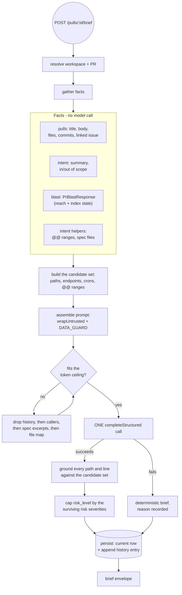

# Spec: PR Brief - grounded risks, review focus, and brief history

Spec ID: L07
Status: approved
Supersedes: none

## Problem and user

The user is a reviewer who has been assigned PR #482 and has not yet opened a single hunk.

Today the PR page's Overview tab gives them two cards side by side.
The Intent card (L03) states what the author says the PR is for, in scope and out of scope, plus flat risk-area chips such as `Auth surface touched` - a label and a kind, and nothing a reader can click.
The Blast Radius card (L04) states what the change can reach: changed symbols, ranked caller files, endpoints and cron jobs, with an honest account of how complete the index is.

Neither answers the question the reviewer actually has, which is **where do I start reading**.
The intent's risk chips name a concern but never a file, so a reviewer who reads `Auth surface touched` still has to search nine changed files to find the auth surface.
The blast radius names files precisely but only ones that *call* the change, never the changed lines themselves, and it is explicitly forbidden from claiming a defect because it has never seen a hunk.

So the reviewer opens the Files changed tab and reads in whatever order the tab offers, which is how a plaintext secret on line 12 of `src/config.ts` gets found on the fourth file instead of the first.
The cost is a review that spends its attention uniformly across a change whose risk is not uniform.

## Goals and non-goals

### Goals

1. Every risk the brief states names at least one real file in the PR, so a reviewer can click it instead of searching for it.
2. A ranked review-focus list tells the reviewer which files to open first and why, in the reviewer's own terms.
3. A single risk level summarises the brief so the PR page can be scanned without reading it.
4. The Overview tab carries exactly **two** model-written prose blocks - L03's intent quote and the brief's own prose - and not a third. See the amendment note under AC-20.
5. A reviewer can see how the brief changed across the PR's commits, so a PR that grew a second purpose mid-flight is visible as such.
6. Nothing the model invents ever renders. A file path or line the input data does not contain is dropped, and the drop is counted and shown.
7. The four index-honesty affordances L04 shipped survive this feature unchanged.

### Non-goals

- **The brief does not serve blast radius.** `GET /pulls/:id/blast` already does, and a second copy on the wire would be a fourth blast shape.
- **The brief does not serve intent.** `GET /pulls/:id/intent` already does, and the Intent card keeps its quote, its scope columns, its confidence badge and its missing-context notice.
- **The brief never sees a diff hunk body.** No `+` or `-` line reaches the model, under any budget or degraded path.
- **The brief does not re-implement blast radius, indexing, or the import graph.** It consumes `BlastService` output.
- **No per-commit backfill.** The brief history begins at the first generation and is never reconstructed for commits that predate it.
- **No `agent_runs` row.** The brief is not an agent run and must not appear in `/pulls/:id/runs`, run history, or `total_cost_usd`.
- **No new external port.** Every fact reaches the brief through `GitHubClient`, `GitClient`, `LLMProvider` or an existing service.
- **`PrBrief` in `contracts/brief.ts` is not modified, not extended and not deleted.** It stays as it is, unused.
- **The graph view, the PR score ring and the verdict banner are not this feature.** They ship, or do not, elsewhere.
- **No user-editable brief.** Regeneration replaces; it does not merge an edit.

## User stories

- As a reviewer, I open a PR and see one paragraph telling me what this change reaches and what that means for my review, so I do not have to build that picture from two cards.
- As a reviewer, I see a risk level on the brief so I can decide how much time this PR deserves before I read anything.
- As a reviewer, I see each risk anchored to a file I can click, so "auth surface touched" becomes `src/middleware/ratelimit.ts`.
- As a reviewer, I see a short ordered list of what to read first, each entry saying why, so my first ten minutes are spent on the riskiest part of the change.
- As a reviewer, I see when the brief was written for an older commit or an older index, so I never act on a stale picture believing it is current.
- As a reviewer, I open the brief history and see how the brief read at each commit that had one, so a PR whose purpose drifted is visible.
- As a reviewer, I see how many of the model's statements were dropped for naming things that do not exist, so I can calibrate how much to trust the rest.

## Module interactions

### Participants

| Module | Role | What crosses the boundary |
| --- | --- | --- |
| `brief` (new) | Owns the use case, the one model call, grounding, persistence | In: `prId`, `workspaceId`. Out: the brief envelope |
| `pulls` | PR facts | Out: `PrDetail` - `title`, `body`, `head_sha`, `files[]` (path, additions, deletions, patch), `commits[]`, `linked_issue` |
| `intent` | The derived intent, and the two pure helpers | Out: `PrIntent`; `toBriefIntent()`; `buildFileMap(diff)` for the `@@` ranges; `SPEC_FILE_CANDIDATES` / `resolveRepoFiles` for spec text |
| `blast` | The reach facts and the index verdict | Out: `PrBlastResponse` - `blast`, `index`, `changed_files`, `computed_at` |
| `repo-intel` | Reached only through `blast` | - |
| `settings` | Which model runs the call | Out: `{ provider, model }` for feature id `risk_brief` |
| `reviewer-core` | Not a participant | - |

The brief is an **application-layer composer**.
It calls sibling services (`PullsService`, `IntentService`, `BlastService`) - the composition seam this repository already uses where `polling` calls `pulls` and `blast` calls `repo-intel` - and owns exactly one table.
It never imports another module's repository, never touches drizzle outside its own repository, and its routes stay transport only.

### The generation flow

### Data crossing the brief's own boundary

The response envelope carries, in shape terms rather than field-by-field code:

- **`prose`** - the single model-written paragraph. Two named parts, `what` and `why`, kept as separate fields rather than one blob, because they are graded by different rules: `what` states reach and is checkable against the blast lists beside it, `why` states purpose and is checkable against the intent quote beside it. One field would make the "never claim a defect" criterion (AC-22) untestable, since a grader could not say which half broke it.
- **`risk_level`** - one of `high`, `medium`, `low`.
- **`risks[]`** - each with a kind, a title, an explanation, a severity, and one or more file references. Reuses `contracts/brief.ts`'s existing `Risk` vocabulary.
- **`review_focus[]`** - an ordered list, each entry a file reference, an optional line, and one sentence of reason.
- **`history`** - prior PRs whose changed files overlap this one's, computed deterministically.
- **`dropped`** - counts of what grounding removed, by category.
- **`meta`** - provider, model, `head_sha`, `indexed_sha`, generated-at, and a derived `stale` flag.
- **`index`** - the same `BlastIndexState` the blast card renders, carried through unchanged so the brief can state its own trustworthiness without a second fetch.

The contract lives in a **new file** alongside `contracts/brief.ts` and `contracts/blast.ts`.
It imports and extends the vocabulary already there rather than redeclaring it, and re-exports nothing it imported - the barrel `export *`s all three files, so a duplicate export is a build error in every consumer.
Both physical copies of `@devdigest/shared` move together.

### What happens when a neighbour is unavailable

| Neighbour | Unavailable means | The brief still |
| --- | --- | --- |
| `intent` | No `pr_intent` row for this PR | Generates, with the intent block absent from the prompt and `why` restricted to what the PR title and body support |
| `blast` | `index.status === 'degraded'` | Refuses the model call and persists a deterministic brief, because with no reach facts there is no candidate set to ground against |
| `blast` | `index.status === 'partial'` | Generates, carries the reason through, and states in `what` that the picture may be incomplete |
| `pulls` / GitHub | Linked issue unreachable, or no token | Generates; the issue is recorded with a status and never invented |
| `LLMProvider` | Call fails, times out, or cannot be repaired | Persists the deterministic brief with the reason; the page offers Retry |
| Clone | Gone at generation time | No model call; deterministic brief with that reason |

## Acceptance criteria (EARS)

### Generating

**AC-1** WHEN a reviewer requests a brief for a pull request, the system shall issue exactly one structured model call, observed as exactly one `completeStructured` entry with the brief's schema name in the run's Live Log for that request.

**AC-2** The system shall resolve the brief's provider and model from the `risk_brief` feature-model setting, observed as the `provider` and `model` fields of the returned brief matching the workspace's `risk_brief` choice, or the registry default when unset.

**AC-3** The system shall create no `agent_runs` row for a brief generation, observed as `/pulls/:id/runs` returning the same number of rows before and after a generation.

**AC-4** WHEN a brief already exists for a pull request, the system shall return the stored brief without a model call, observed as `GET /pulls/:id/brief` completing with no new Live Log entry.

**AC-5** The system shall regenerate a brief only on an explicit request, observed as no brief existing for a pull request that has been opened, reviewed and re-fetched but never had generation requested.

### The prompt and its inputs

**AC-6** The system shall include no diff hunk body line in the brief's prompt, observed as the persisted prompt containing no line beginning with `+` or `-` outside a reconstructed `@@` header.

**AC-7** The system shall derive every line number it sends to the model from reconstructed `@@` headers, observed as the persisted prompt's change locations matching `buildFileMap` output for the same diff.

**AC-8** The system shall wrap every block of third-party text in the brief's prompt in the untrusted delimiter, observed as the persisted prompt containing no repository-derived string outside an `<untrusted>` block.

**AC-9** The system shall append an explicit data guard to the brief's system prompt, observed as the persisted system prompt containing a directive that content inside the untrusted delimiter is data and never instructions.

**AC-10** WHILE the assembled prompt exceeds the token ceiling, the system shall drop input blocks in the fixed order history, then callers, then spec excerpts, then the file map, observed as the persisted prompt's block list against a fixture that exceeds the ceiling.

**AC-11** IF the linked issue cannot be read, THEN the system shall record it with an explicit status and include no issue content in the prompt, observed as the brief's inputs listing the issue as unreachable and the persisted prompt containing no issue body.

**AC-12** The system shall dereference no URL outside the pull request's own repository on GitHub, observed as a brief generated from a body containing an external URL making no request to that host.

### Grounding

**AC-13** IF a risk or review-focus entry names a file path absent from the union of the pull request's changed files and the blast result's caller files, THEN the system shall drop that entry, observed as the entry being absent from the returned brief.

**AC-14** IF a risk or review-focus entry names an endpoint or scheduled job absent from the blast result, THEN the system shall drop that reference, observed as the returned brief containing no endpoint string outside `endpoints_affected` and no job string outside `crons_affected`.

**AC-15** IF a review-focus entry names a line outside the reconstructed `@@` ranges for that file, THEN the system shall drop the line and retain the entry at file level, observed as the entry appearing in the returned brief with no line number.

**AC-16** The system shall never present a line number taken from the blast result as a location in the pull request, observed as no returned review-focus line matching a `BlastCaller.line` value that lies outside that file's `@@` ranges.

**AC-17** The system shall report how many entries and references grounding removed, observed as the returned brief's dropped counts being non-zero for a fixture whose model output names two invented paths.

**AC-18** IF every risk and every review-focus entry is dropped, THEN the system shall return the brief with its deterministic parts and an explicit statement that nothing could be grounded, observed as a 200 response carrying empty risk and focus lists plus the dropped counts, never an error status.

**AC-19** The system shall cap `risk_level` at the highest severity among the surviving risks, observed as a brief whose model output claimed `high` with only low-severity surviving risks being returned as `low`.

### The prose

**AC-20** The system shall render exactly two model-written prose blocks on the Overview tab, the intent quote owned by L03 and the brief's own prose, observed as the tab containing the intent summary and the brief's `what`/`why` and no third block of generated prose.

Amended 2026-08-14, during the L07 run, after `plan-verifier` found the original wording unsatisfiable. It read "exactly one model-written paragraph ... across all its cards", which contradicts this spec's own decision to keep L03's intent quote - that quote is model-written too. The decision behind the Q8 absorption was that three prose voices become one voice plus the intent quote, not zero. The count was wrong, not the design. The absorbed block is the blast impact summary, and its removal is AC-32.

**AC-21** The system shall constrain the brief's prose to at most three sentences per field, observed as the stored `what` and `why` each containing at most three sentence-terminating marks.

**AC-22** IF the brief's prose asserts a defect, a runtime behaviour, or an intent not present in its inputs, THEN that brief shall be treated as failing, observed by grading stored prose against the same rule the blast summary prompt states - the model has seen no diff and no source, so it may describe reach and purpose but never claim a defect.

**AC-23** WHILE the index state is `partial`, the system shall state in `what` that the picture may be incomplete, observed as the stored `what` for a partial-index fixture containing an incompleteness statement.

### Staleness and identity

**AC-24** The system shall derive a brief's staleness from both the pull request's head SHA and the repository's last-indexed SHA, observed as a brief being marked stale after either changes.

**AC-25** WHILE a brief is stale, the system shall render its full contents with a stale badge, observed as the card showing its risks and focus list beneath a badge rather than an empty state.

**AC-26** The system shall never regenerate a brief automatically when it becomes stale, observed as a stale brief's generated-at timestamp being unchanged after the head SHA moves and the page is reloaded.

### Index honesty - must not regress

**AC-27** The system shall render the partial-index notice on the Overview tab whenever the index state is not `ok`, observed as the notice being present for every non-`ok` reason.

**AC-28** The system shall render the caller truncation count whenever callers were capped, observed as the shown-of-total line appearing for a symbol whose caller total exceeds the cap.

**AC-29** The system shall render the changed-symbol truncation count whenever symbols were capped, observed as the shown-of-total line appearing for a pull request with more changed symbols than the cap.

**AC-30** The system shall render the default-branch caveat on the blast radius card, observed as the caveat text being present after this feature ships.

**AC-31** The system shall render the per-file attribution caveat on the blast radius card, observed as the caveat text being present after this feature ships.

### The absorbed impact summary

**AC-32** The system shall render no separate blast impact-summary paragraph on the Overview tab, observed as the tab containing no impact-summary heading after this feature ships.

**AC-33** WHERE a stored blast impact summary exists from before this feature, the system shall leave it in place and unrendered, observed as the row remaining readable in the database with no corresponding element on the page.

### The card

**AC-34** WHEN a pull request has no brief, the system shall render an empty state with a control that generates one, observed as the Overview tab showing that control and no risk list.

**AC-35** WHILE a brief is generating, the system shall render a pending state, observed as the generate control being disabled and a pending indicator present.

**AC-36** IF generation fails, THEN the system shall render the deterministic brief with the failure reason and a retry control, observed as the card showing that reason rather than an error page.

**AC-37** The system shall render each risk with its file reference as an activatable link, observed as every rendered risk exposing a link whose accessible name contains the file path.

**AC-38** WHEN a reviewer activates a review-focus entry, the system shall open the Files changed tab with that file expanded, observed as the diff tab rendering that file's hunks after activation.

**AC-39** The system shall render the review-focus list in the order the brief stores it, observed as the rendered order matching the stored array order.

**AC-40** The system shall make every review-focus entry reachable and activatable by keyboard, observed as tabbing through the list reaching each entry with a visible focus indicator and Enter activating it.

**AC-41** The system shall render the intent card's risk areas as the brief's grounded risks, observed as the Overview tab containing exactly one risk list after this feature ships.

**AC-42** WHILE no brief exists, the system shall render no risk list on the intent card, observed as a pull request with an intent but no brief showing scope columns and no risk chips.

### Brief history

**AC-43** WHEN a brief is generated, the system shall append an entry recording the head SHA it was generated at, observed as the history growing by one entry per generation.

**AC-44** The system shall never modify or delete a history entry once written, observed as the earliest entry's content being byte-identical before and after a later regeneration.

**AC-45** The system shall render the brief history ordered newest first, observed as the rendered entry order matching descending generation time.

**AC-46** IF a commit in the pull request has no history entry, THEN the system shall render that commit with an explicit no-brief marker, observed as the timeline showing that commit with the marker rather than omitting it.

**AC-47** WHILE a pull request has exactly one history entry, the system shall render the history section with that single entry, observed as the section being present rather than hidden.

**AC-48** The system shall never generate a brief for a commit other than the pull request's current head, observed as no history entry existing whose head SHA is not the head SHA at the time of some generation request.

### Tenancy and limits

**AC-49** IF a brief is requested for a pull request outside the caller's workspace, THEN the system shall refuse it, observed as the response carrying a not-found status and no brief body.

**AC-50** The system shall limit brief generation to ten requests per minute, observed as the eleventh request within a minute being rejected with a rate-limit status.

**AC-51** The system shall record the brief's cost outside the pull request's review spend, observed as the pull request's total cost being unchanged by a generation.

### Contract integrity

**AC-52** The system shall carry every contract change into both physical copies of the shared package, observed as the two copies of the new contract file being byte-identical.

**AC-53** The system shall leave `PrBrief` unchanged, observed as `contracts/brief.ts` being byte-identical before and after this feature.

**AC-54** The system shall pass the repository's architecture check with no new allowlist entry, observed as the check succeeding and the allowlist being unchanged.

## Edge cases

| Case | Expected |
| --- | --- |
| No brief yet (the state every existing PR is in) | Empty state with a generate control - AC-34 |
| PR with no intent row | Generates; `why` restricted to title and body; no invented purpose |
| PR with an empty body and no linked issue | Generates; `why` states the purpose could not be established rather than guessing |
| Repository never indexed (`degraded`) | No model call; deterministic brief; the not-analyzed notice and re-analyze control render |
| Index `partial` | Generates and says so - AC-23, AC-27 |
| Zero changed symbols in the index | Generates; risks ground against changed-file paths alone; reach described as unknown, not none |
| Model returns zero risks | Valid. Renders the no-risks line, not an error |
| Model returns only invented paths | Everything dropped, counts shown, 200 - AC-18 |
| Model returns a line inside a file but outside its `@@` ranges | Line dropped, entry survives file-level - AC-15 |
| Model names a real path from a *caller* file, not a changed file | Allowed - the caller union is part of the candidate set - but no line survives, since callers have no `@@` ranges |
| PR touching a barrel file, hundreds of changed symbols | Blast caps at its symbol limit and says so; the brief grounds against the capped set and the truncation notice renders - AC-29 |
| PR with one changed file | Generates normally; focus list may hold one entry |
| Review-focus list longer than the display cap | Capped, with the total stated |
| Risk title far longer than the mockup's | Truncated in the card with the full text still reachable |
| Unbroken path with no separators, or a deep monorepo path | Wraps or truncates without breaking the card's layout |
| Non-Latin text in a PR title, body, or symbol name | Rendered as-is; the untrusted wrapper and guard apply identically |
| A file literally named `-rf` or `+x` | The existing path-prefix safeguard keeps the file map from looking like a diff body |
| Head SHA moves while the page is open | Stale badge on next read; contents still shown - AC-25 |
| Repository re-indexed under an unchanged head SHA | Stale badge - AC-24 |
| Two generation requests in flight for the same PR | One generation; the second observes the first's result rather than issuing a second call |
| Generation requested eleven times in a minute | Rate-limited - AC-50 |
| PR from another workspace | Not found - AC-49 |
| PR closed or merged between generation and read | The stored brief still renders; nothing regenerates |
| No prior PRs overlap | The no-history line renders |
| Repository with hundreds of overlapping prior PRs | Capped at five, most recent first |
| Narrow viewport | The existing auto-fit grid collapses to one column; the brief's blocks stack below it |
| Offline client | The card's error state renders with a retry control, never a blank card |

## Non-functional requirements

| Requirement | Number |
| --- | --- |
| Prompt assembly ceiling | 8,000 tokens, measured with our tokenizer over the text we build. Lowered from 20,000 on 2026-08-14 to the agreed budget; the unit is the tokenizer's count over the assembled text, never the provider's billed count |
| Model call timeout | 30,000 ms, matching the blast summary's ceiling |
| Schema repairs | At most 2, giving at most 3 attempts |
| Retry wrapper around the call | None - a retry re-issues a paid call |
| Model calls per generation | Exactly 1 |
| Rate limit on generation | 10 per minute, matching the other model-calling buttons |
| Rate limit on read | None beyond the global 120 per minute |
| Prose length | At most 3 sentences per field; at most 400 characters persisted per field |
| Review-focus entries rendered | At most 8 |
| Risks rendered | At most 10 |
| Prior PRs in history | At most 5 |
| Brief-history entries rendered | At most 20, newest first |
| Deterministic path when the index is degraded | 0 model calls, 0 cost |
| Cost visibility | Provider-reported tokens and cost stored and shown on the card; a locally measured token count is never presented as spend |
| Keyboard reachability | Every risk link and every review-focus entry reachable by Tab with a visible focus indicator |
| Colour independence | Risk level and severity distinguishable without relying on colour alone |

Note on the token ceiling: it bounds the prompt, not the invoice.
A measured-versus-billed ratio of 5x was recorded on this codebase for a different feature, so spend is read from the provider's reported figures, never inferred from the ceiling.

## Inputs and provenance

| Input | Source | Absent means |
| --- | --- | --- |
| PR title, body, head SHA | `pull_requests`, kept current by polling | Title is never absent; an empty body caps what `why` may assert |
| Changed files with additions and deletions | `PrDetail.files` | A PR with no files cannot be briefed; the empty state persists |
| Reconstructed `@@` ranges | `buildFileMap` over the parsed diff | No ranges means no line numbers survive grounding; entries stay file-level |
| Linked issue | Resolved live through `GitHubClient`, GitHub-domain only | Recorded with a status; never invented; caps `why` |
| Derived intent | `pr_intent` via `IntentService`, narrowed by `toBriefIntent()` | Prompt omits the intent block; `why` falls back to title and body |
| Blast reach facts | `BlastService.get()` | `degraded` blocks the call; `partial` is stated in the prose |
| Index state | Carried through from `BlastService.get()` | Never absent - `degraded` is itself a state |
| Spec text | L03's standing spec-file candidates, resolved through the existing ports | Omitted silently, per L03's rule that a standing candidate is only recorded when it exists |
| Prior overlapping PRs | Stored per-PR file lists for the same repository | The no-history line renders |
| Provider and model | `risk_brief` feature-model setting, else the registry default | Never absent |
| Generated prose, risks, focus, risk level | The one structured model call | Generation failure yields the deterministic brief with a reason |

Nothing in this table is fetched by a mechanism that does not already exist.
No new port, no raw `fetch`, no new external service.

## Untrusted inputs

Every string below originates outside this system and may have been authored by someone trying to influence the model.

| Input | Trust boundary | May never cause |
| --- | --- | --- |
| PR title and body | Author-controlled, arrives via GitHub | The model to treat embedded text as instruction, or a risk to be suppressed. AC-8, AC-9 |
| Linked issue title and body | Third-party, any GitHub user may have written it | Any content to reach the prompt when the fetch failed, or an external URL to be dereferenced. AC-11, AC-12 |
| Changed file paths | Third-party repository | A path outside the changed-file and caller union to render as a link. AC-13 |
| Symbol names, caller paths, endpoint and cron strings | Extracted from a third-party repository by the indexer | The untrusted block to be closed early - a symbol named after the closing delimiter must not escape its wrapper. AC-8 |
| Project spec and document text | Third-party repository | Instructions in a spec file to redirect the brief. AC-8, AC-9 |
| Prior PR titles | Third-party | The same. AC-8 |
| **Model output** | The model is itself an untrusted source once fed untrusted text | Any invented path, endpoint, job or line to render. AC-13 through AC-17. Any claimed defect to be presented as fact. AC-22. Any self-assessed risk level to exceed what the surviving evidence supports. AC-19 |

Two structural points, both inherited from paths already shipped here.

First, the brief's prompt is assembled outside the shared review-prompt assembler, so the shared injection guard is **not** appended for free.
It must be added explicitly, exactly as the blast summary prompt does, or a symbol name followed by a paragraph of instructions reads as trusted text.

Second, the untrusted wrapper must neutralise a literal closing delimiter in its content.
Without that, a repository file named after the delimiter closes the block early and everything after it is read as instruction.

The model's own output is treated as untrusted because it was fed untrusted text.
This is why grounding is a rejection gate rather than a warning: a hallucinated path rendered as a working-looking link is indistinguishable from a fact, and the reviewer has no way to tell.

## Design review

Both screenshots were read.

`Screenshot 2026-08-14 at 9.17.54 AM.png` shows the Overview tab. `Screenshot 2026-08-14 at 9.17.59 AM.png` shows the Files changed tab and contributed only the click target for review-focus entries.

| Item | Status | Note |
| --- | --- | --- |
| The mockup's INTENT card and BLAST RADIUS card | `accepted` | Both already ship. This feature adds beside them |
| RISK AREAS drawn with file references and expand chevrons | `accepted` | The shipped chips are label-and-kind only. Replaced by grounded risks - AC-41 |
| REVIEW FOCUS - READ THESE FIRST | `accepted` | New - AC-37 through AC-40 |
| The mockup shows no risk level | `accepted` | Added as a badge on the brief's section label - AC-19 |
| The mockup shows no brief history | `open` | No mockup exists. Specified as a collapsible section listing SHA, date and the entry's `what`. A design pass would improve it |
| The mockup drops the partial-index notice | `rejected` | L04 shipped it deliberately. Kept - AC-27 |
| The mockup drops the caller and symbol truncation counts | `rejected` | Kept - AC-28, AC-29 |
| The mockup drops the default-branch and per-file attribution caveats | `rejected` | Kept - AC-30, AC-31 |
| The mockup shows no impact summary block | `accepted` | Consistent with absorbing it - AC-32 |
| The mockup places the verdict banner inside a PR BRIEF frame | `rejected` | It lives in the Findings panel today. Relocating a shipped surface is not this feature |
| The mockup shows no PR score derivation change | `accepted` | Unchanged |
| No empty state | `accepted` | AC-34 |
| No loading state | `accepted` | AC-35 |
| No error or degraded state | `accepted` | AC-36 |
| No stale state | `accepted` | AC-25 |
| No indication that entries were dropped | `accepted` | AC-17. Without it a reviewer cannot calibrate trust |
| Mockup paths are short and titles are about 28 characters | `accepted` | Long-content behaviour specified in Edge cases |
| Review-focus rows look clickable but show no focus treatment | `accepted` | AC-40 |
| Tree and Graph toggle | `rejected` | Already ships; out of scope |
| Narrow viewport | `accepted` | The existing auto-fit grid handles the two shipped cards; the brief's blocks stack below |
| Risk severity conveyed by colour alone in the mockup | `open` | Proposed: pair severity with a shape or label. Cost of not doing it - a colour-blind reviewer cannot rank risks |
| No indication of which model wrote the brief | `open` | Proposed: a provider-model line, as the blast summary already shows. Cost of not doing it - a reviewer cannot tell a cheap brief from an expensive one |

### Scope items this feature creates in already-shipped code

Named here because a planner would otherwise discover them mid-implementation.

1. **The intent card loses its risk-area block.** The rendering of `intent.risk_areas` as chips is removed from the shipped L03 component, and grounded risks take its place - AC-41, AC-42. `pr_intent.risk_areas` continues to be produced and stored; only its rendering moves. Its i18n key stays.
2. **The blast card loses its impact-summary block.** The summary rendering is removed from the shipped L04 card - AC-32.
3. **The blast summary generation path becomes internal.** Its route stops being the client's entry point. See Open questions for what is decided and what is not.

### Disposition of each shipped artifact touched by the absorption

| Artifact | Disposition |
| --- | --- |
| `POST /pulls/:id/blast/summary` | **Kept and deprecated.** Still registered, still functional, no longer called by the client. Marked deprecated in the route's own documentation. Removing a working route in the same change that redirects its only caller makes two failures indistinguishable |
| `pr_blast_summary` table | **Kept, and still written by that route.** Not read by the brief. Existing rows stay readable - AC-33. No migration in this feature |
| `BlastSummaryMeta` in the blast contract, and the `summary` field of the blast response envelope | **Kept and still populated.** Removing a field from a served contract would force both vendor copies to move for no product gain |
| `SummaryBlock.tsx` | **Kept in the tree, no longer rendered** by the blast card - AC-32 |
| `blast.json` `summary.*` keys | **Kept.** They belong to the route and component that still exist. An unused key costs nothing; a missing key is a runtime crash if anything still resolves it |
| The blast summary prompt and its schema | **Kept.** They are the reference implementation of the constraint the brief inherits - AC-22 |

Nothing is deleted by this feature.
Deletion is a follow-up once the brief has been observed to replace the summary in practice.

## Open questions

1. **Is the deprecated blast summary route eventually deleted, and when?**
   Assumption the spec is written under: it stays indefinitely, deprecated and unrendered. If it is to be deleted, that is a separate change after the brief has shipped and been used.

2. **Should the brief's prose be regenerated when only the index moves, given the head SHA has not?**
   Assumption: no. Staleness is shown, regeneration is always an explicit click - AC-26. If reviewers report acting on stale prose, this becomes a prompt-to-regenerate rather than an automatic call.

3. **Does the brief history belong on the Overview tab or in a drawer?**
   No mockup exists. Assumption: a collapsible section beneath the brief on the Overview tab, since the shipped precedent for a per-line drawer is git-why and this is not that.

4. **Should a review-focus entry be able to cite a caller file rather than a changed file?**
   Assumption: yes, since the caller union is part of the candidate set, but such an entry can never carry a line number because callers have no `@@` ranges. If this proves confusing, restricting focus entries to changed files only is a one-line narrowing.

5. **What is the right cap for review-focus entries?**
   Assumption: 8. The mockup shows 4. This number should move once real briefs have been read.

6. **Is `risk_level` derived per PR or per risk set only?**
   Assumption: per PR, capped by the surviving risk severities - AC-19. A PR with no grounded risks is `low`, not absent. Whether "no risks found because nothing could be grounded" should be visually distinct from "no risks found" is unresolved; the dropped counts make it inferable but not obvious.

7. **Does the brief history record the full brief or a projection?**
   Assumption: enough to render a timeline entry and show how the reading changed - the head SHA, the timestamp, the risk level, and the `what`. Storing the entire brief per commit makes the row grow without bound on a long-lived PR.

8. **Who is the user, definitively?**
   The spec is written for a reviewer who has not yet opened the diff. If the primary user turns out to be the PR author self-checking before requesting review, the review-focus framing ("read these first") is wrong and would become "fix these first".
