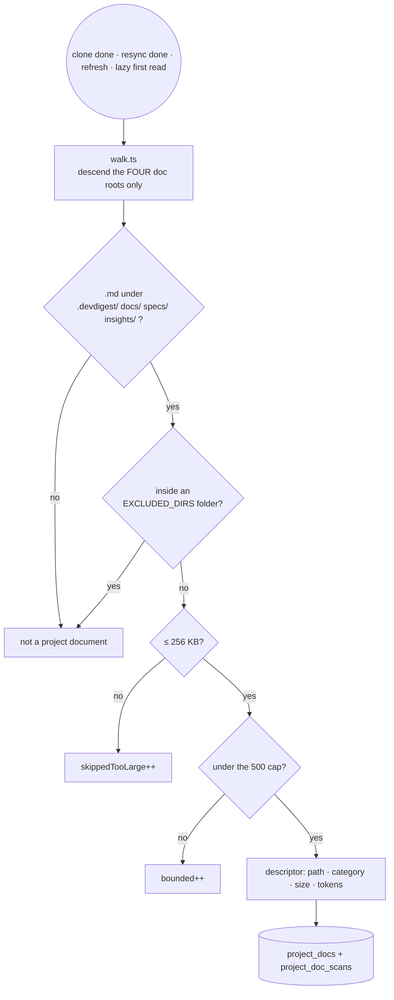

# `project-context` — the repository's own written truth, in the prompt

An imported repository already carries the project's rules: PRDs, specs, an
architecture note, incident write-ups. This module discovers that Markdown,
lets the product browse and read it, lets a user attach chosen documents to an
**agent** or a **skill** in an explicit order, and injects the attached bodies
into the review prompt's `## Project context` section.

The engine seam already existed and was unfed: `reviewer-core` has always taken
`specs: string[]`, rendered each entry `wrapUntrusted`-wrapped, and recorded the
block in `PromptAssembly.specs`. L05 fills it. Spec:
`docs/specs/L05-project-context.md`.

## Discovery

The walk descends only the four roots, never the whole clone — a repository's
`node_modules` dwarfs its `docs/`, and the 5,000 ms scan budget is met by not
looking at it. No document body is ever persisted: `project_docs` holds
metadata only, and the only text DevDigest stores is the assembled prompt
inside the run trace.

## Files

| File | Layer | What it owns |
| --- | --- | --- |
| `constants.ts` | application | The four roots and every budget: 256 KB, 500 docs, 8k per document, 20k per run |
| `walk.ts` | pipeline | The only file here that touches `node:fs`. Precedent: `repo-intel/pipeline/walk.ts` |
| `paths.ts` | pure | `normalizeDocPath` + `isInsideRoot` — the whole path trust boundary, no I/O |
| `assemble.ts` | pure | Ordering, dedup, heading-boundary truncation, the run budget |
| `repository.ts` | infrastructure | The only file with drizzle imports; owns four tables |
| `service.ts` | application | Use cases + transactions + tenancy. No `node:fs` |
| `routes.ts` | edge | Seven zod-schema'd routes; registers the scan job handler |

## Routes

| Route | Returns |
| --- | --- |
| `GET /repos/:id/context` | `ProjectDocList` — descriptors + scan status |
| `GET /repos/:id/context/doc?path=` | `ProjectDocBody` |
| `POST /repos/:id/context/refresh` | `ProjectDocList` after a fresh scan |
| `GET`/`PUT` `/agents/:id/context` | `AgentContext` (direct + inherited) |
| `GET`/`PUT` `/skills/:id/context` | `SkillContext` |

## Non-obvious decisions

- **Tenancy comes from the layer above.** None of the four tables carries a
  `workspace_id`; the service resolves every incoming repository through
  `container.reposRepo.getById(workspaceId, id)` and every agent/skill through
  that module's service BEFORE the repository is touched. Drop that check in a
  later refactor and an agent can be pointed at another workspace's repository.
- **Every client path is validated on WRITE as well as on read.** An attachment
  row is written today and trusted by the run executor months later, so a stored
  path can never be a traversal.
- **The read path is three checks, in this order, with no filesystem access
  until all three pass**: `normalizeDocPath` (422), `hasDoc` (404 — a
  legal-looking path the globs never matched, like `.env`, is unreadable), then
  `isInsideRoot` (422 — a second belt, because `SimpleGitClient.readFile` does a
  bare `join` with no guard of its own).
- **Run assembly reads the clone directly and never consults `project_docs`**,
  so a run started while a scan is in flight neither waits on it nor sees a
  half-written list. The two safety checks still run on every path; the
  "is it in the current list" check cannot, by construction.
- **A blank body counts as absent.** `MockGitClient.readFile` resolves a MISSING
  path to `''` rather than rejecting, so "it threw" is not the only failure
  shape a document read has.
- **The scan has no `running` status.** Any table with one needs a boot reaper;
  the concurrency guard here is an in-memory single-flight promise map, so a
  crashed process cannot leave a repository permanently locked.
- **Token estimates are `approxTokens` (`ceil(chars/4)`), not the tiktoken
  encoder.** Running a synchronous BPE encode over up to 500 documents inside a
  request would block the event loop that also serves the SSE run stream, and
  the truncation search calls the counter repeatedly. Only the trace's
  `specs_tokens` uses `container.tokenizer.count`, on the single assembled
  block — exactly how `skills_tokens` and `intent_tokens` are computed. The
  number the user is shown and the number the budget enforces stay identical.
- **Attachments do not version the agent.** Reproducibility rests entirely on
  the per-run trace, which is why `prompt_assembly.specs` and `specs_read` are
  not optional.

## Tests

| Lane | Files |
| --- | --- |
| Hermetic unit | `walk.test.ts` · `paths.test.ts` · `assemble.test.ts` |
| DB-backed | `context.it.test.ts` (browsing + attachments) · `assembly.it.test.ts` (a real run's trace, plus the `git status` assertion that the clone is untouched) |
